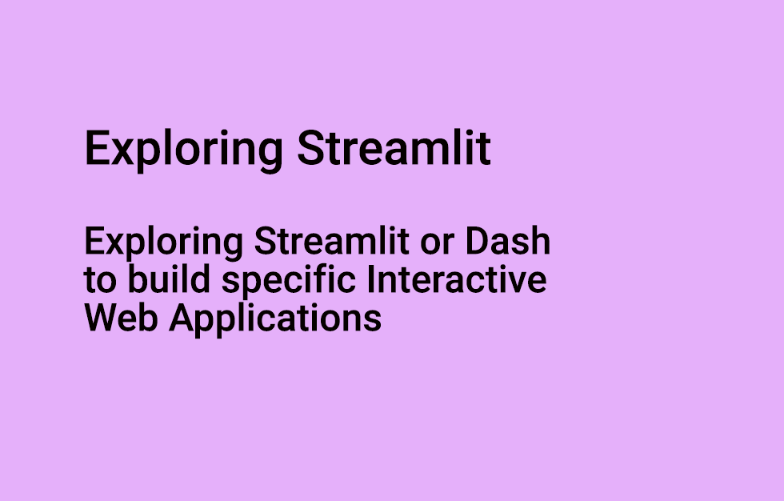
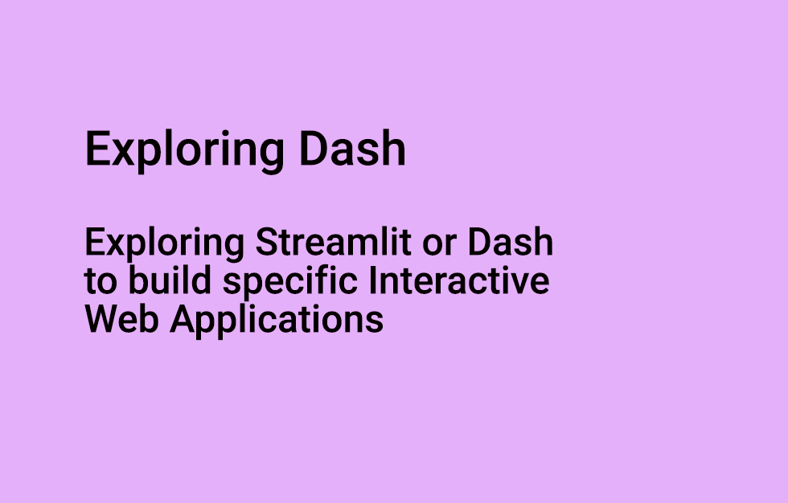

## Exploring Streamlit or Dash to build specific Interactive Web Applications


A quick introduction to [Streamlit](https://streamlit.io/) and [Dash](https://dash.plotly.com/). 

There are 3 main objectives that are to:
- Leveraging intensively on a low-code with library like Streamlit or Plotly Dash
- Quickly and gently retrieving and consolidating heterogeneous data from different sources : mysql dump, csv, pickle, static json file, WP API…
- Focusing on a very SPA (Single Page Application) approach, respecting the single idea rule: one need, one feature, one screen, one application.

[Read more on flaven.fr: http://flaven.fr/2021/05/exploring-streamlit-or-dash-to-build-specific-interactive-web-applications/](http://flaven.fr/2021/05/exploring-streamlit-or-dash-to-build-specific-interactive-web-applications/)


*Du to the size of the CSV, you can replace accidents_2012_to_2014.csv with the real file that can be found on kaggle [@ https://www.kaggle.com/daveianhickey/2000-16-traffic-flow-england-scotland-wales?select=accidents_2012_to_2014.csv](https://www.kaggle.com/daveianhickey/2000-16-traffic-flow-england-scotland-wales?select=accidents_2012_to_2014.csv)*

**Files in `02_interactive_webapps_streamlit_pandas`**

```bash
├── 001_interactive_webapps_streamlit_pandas.py
├── 003_interactive_webapps_streamlit_pandas.py 
├── 003a_interactive_webapps_streamlit_pandas.py 
├── 003b_interactive_webapps_streamlit_pandas.py 
├── 003c_interactive_webapps_streamlit_pandas.py 
├── 004d_interactive_webapps_streamlit_pandas.py 
├── 006_interactive_webapps_streamlit_pandas.py
├── 007_interactive_webapps_streamlit_pandas.py
└── data
```

**Files in `03_interactive_webapps_streamlit_nlp`**

```bash
├── 002_streamlit_for_nlp_projects_streamlit_spacy.py
├── 003_streamlit_for_nlp_projects_text_summarization.py 
├── bf_sample_text_1.txt # sample text
├── capture_1_003_streamlit_for_nlp_projects_text_summarization.png
├── capture_2_003_streamlit_for_nlp_projects_text_summarization.png
├── capture_streamlit_for_nlp_projects_streamlit_spacy.png 
└── cowboy_silhouette_2.png # sample image
```


**Files in `build_interactive_webapps_python_scripts_using_dash`**

```bash
├── 002_streamlit_for_nlp_projects_streamlit_spacy.py
├── 003_streamlit_for_nlp_projects_text_summarization.py 
├── bf_sample_text_1.txt # sample text
├── capture_1_003_streamlit_for_nlp_projects_text_summarization.png
├── capture_2_003_streamlit_for_nlp_projects_text_summarization.png
├── capture_streamlit_for_nlp_projects_streamlit_spacy.png 
└── cowboy_silhouette_2.png # sample image
```


**Files in `build_interactive_webapps_python_scripts_using_dash`**

```bash
├── 001b_plotly_interactive_webapps_dash.py
├── 003_interactive_webapps_dash.py 
├── 003_plotly_interactive_webapps_dash.py
├── 004_interactive_webapps_dash.py
├── 005_interactive_webapps_dash.py
├── 006_interactive_webapps_dash.py 
├── 007_interactive_webapps_dash.py 
├── 008_interactive_webapps_dash.py 
├── 009_interactive_webapps_dash.py
└── README.md
```

### install streamlit
```bash

# to load the installed modules list 
pip list

# to install streamlit
pip install streamlit
streamlit hello


# upgrade streamlit
pip install streamlit --upgrade


```

### install dash
```bash

# to load the installed modules list
pip list

# to install streamlit
pip install dash
pip install jupyter-dash

```


### install other module
```bash
# INSTALL other librairies

# if you are using conda
# conda install ipykernel
# conda install lime

# if you are using pip
pip install ipykernel
pip install lime
pip install shap
pip install langdetect
pip install textblob
pip install transformers
pip install rouge
pip install pandas

# install plotly_express
pip install plotly_express

```
### special install for Gensim

```bash


# On Gensim’s Github changelog 15, they’ve said that the gensim.summarization module has been removed in versions Gensim 4.x because it was an unmaintained third-party module.

# To continue using gensim.summarization, you will have to downgrade the version of Gensim in requirements.txt. Try replacing it with gensim==3.8.3 or older.

# You are stuck with gensim==3.8.3 or older but not the Gensim 4.x

pip install --upgrade gensim
conda install -c anaconda gensim
pip install gensim==3.8.3

```

## VIDEOS
[Part 1 - Exploring Streamlit or Dash to build specific Interactive Web Applications](https://www.youtube.com/watch?v=jCmL4YMQ_rs)
[](https://www.youtube.com/watch?v=jCmL4YMQ_rs)


[Part 2 - Exploring Streamlit or Dash to build specific Interactive Web Applications](https://www.youtube.com/watch?v=swiHcsVTxGo)
[](https://www.youtube.com/watch?v=swiHcsVTxGo)

