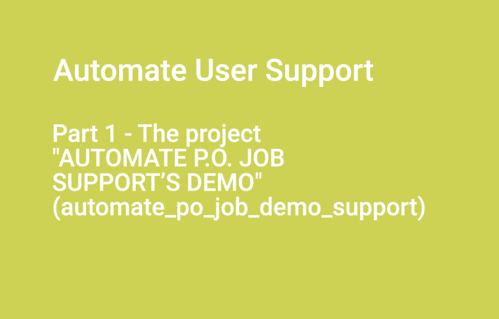
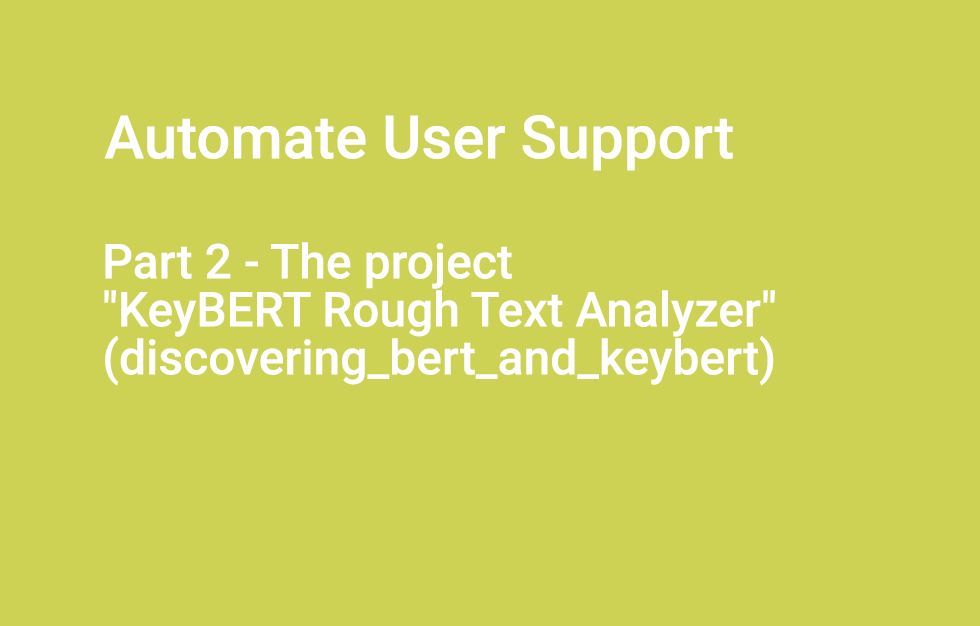

# discovering_bert_and_keybert


**Part of a post on how to work with efficiency on customer support with the help of Streamlit, Sqlalchemy and keyBert. The objective is to answer as quick as possible to your consumer feedback!**

**The Streamlit application, presented below, has an simple objective : to leverage on automatic keyword generation. This principle is everywhere for multipurpose when you are dealing with texts from Chat solution to any text analysis solution. So, in my case, it will be analyze my users support's heavy burden.**

**The project leverages on these libraries.**
- [Streamlit: https://streamlit.io/](https://streamlit.io/)
- [KeyBERT: https://maartengr.github.io/KeyBERT/](https://maartengr.github.io/KeyBERT/index.html)

## 1. Create an environment with Conda
**I am using Anaconda to manage the python environment**

Check the official website at [Anaconda: https://www.anaconda.com/](https://www.anaconda.com/)


```bash
# Conda Environment
conda create --name bert_flair_1 python=3.9.7
conda info --envs
source activate bert_flair_1
conda deactivate
# if needed to remove
conda env remove -n [NAME_OF_THE_CONDA_ENVIRONMENT]

```


## 2. Install the required modules in Python

**You can either install manually or use the requirements file `bert_flair_1.txt` to install the modules.**

```bash

pip install pytorch-pretrained-bert
pip install spacy ftfy==4.4.3
python -m spacy download en

pip install keybert[flair]
pip install keybert[gensim]
pip install keybert[spacy]
pip install keybert[use]

pip install -U sentence-transformers
-U, --upgrade Upgrade all packages to the newest available version

# to export requirements
pip freeze > bert_flair_1.txt


# to install requirements
pip install -r bert_flair_1.txt


```

## 3. Directory tree for `discovering_bert_and_keybert`
**The project's structure with some indications for each file in comment.**

```bash
.
├── README.md
├── bert_flair_1.txt # the requirements
├── config_values
│   └── values_conf.py # confif values for the app
├── stopwords # stop words for (it', 'fr', 'es', 'ru')
│   ├── stopwords_es.txt
│   ├── stopwords_fr.txt
│   ├── stopwords_it.txt
│   └── stopwords_ru.txt
├── test_python_new_14_multilang_keybert.py # the streamlit app with keyBERT
└── texts_examples_intl.py # text samples in ('en', 'it', 'fr', 'es', 'ru')

```

## 4. Videos
**3 additional videos to tackle this post**


[Part 1 - The project  "AUTOMATE P.O. JOB SUPPORT’S DEMO" (automate_po_job_demo_support)](https://www.youtube.com/watch?v=YUmClVfNbN8)
[](https://www.youtube.com/watch?v=YUmClVfNbN8)


[Part 2 - The project  "KeyBERT Rough Text Analyzer"  (discovering_bert_and_keybert)](https://www.youtube.com/watch?v=k8L2_Hrvn-w)
[](https://www.youtube.com/watch?v=k8L2_Hrvn-w)


[Part 3 - The merge of the 2 projects:  "KeyBERT Rough Text Analyzer" and  "AUTOMATE P.O. JOB SUPPORT’S DEMO"  (all_in_one_automate_po_job_demo_support_keybert)](https://www.youtube.com/watch?v=XVfD0ubrjhg)
[](https://www.youtube.com/watch?v=XVfD0ubrjhg)
