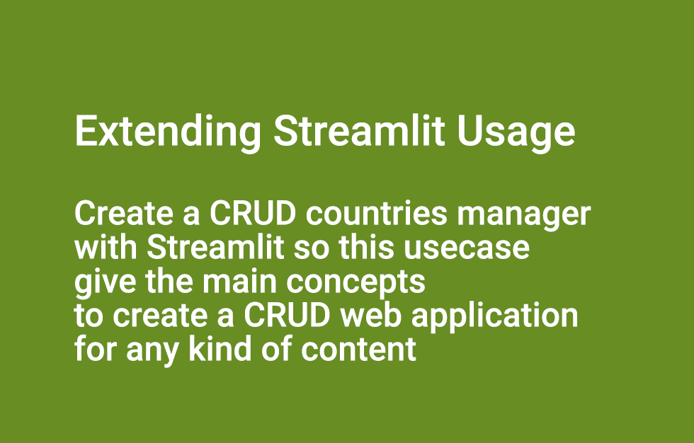

## extending_streamlit_usage

**A list of directories with dirrents type of attempts based on Streamlit**

Find the article on my blog @ "Extending Streamlit usage to create data science applications and other type of applications" :: [https://flaven.fr/2021/06/extending-streamlit-usage-to-create-data-science-applications-and-other-type-of-applications/](https://flaven.fr/2021/06/extending-streamlit-usage-to-create-data-science-applications-and-other-type-of-applications/)

### 001_nlp_spacy_python_realp
A bunch of scripts extracted from an excellent article "Natural Language Processing With spaCy in Python"

### 002_wamp_mysql_python
Some experiments with WP hosted locally with XAMP and Spacy retrieving Posts from the WP MySQL database.

### 003_99_ambitieuses_derwenai_spacy_tutorials
This quick POC was made for a theater play made by in a 99 projects about Women Ambition. This analysis was made with Spacy, Pandas, Seaborn... a real case. *I have replaced the real text with article from by blog du the fact that the text was not officially released.*

### 003_99_ambitieuses_text_data_analysis_for_comedians_nlp_project
An exploration of this project that gives a lot of insights on how to cleanup text to load in a pandas dataframe.

### 005_other_nlp_attempts
An advanced NLP text classification that require a lot of install. Caution, if you do not have the correct environment it won’t work properly, it will not work especially gensim library corpus for instance e.g. glove-wiki-gigaword-50.gz


### 006_script_in_script
A modest start with some Streamlit basic diversion examples. The POC is there, it remains to sophisticated the usecases. In practic, the objective should be to quickly design a web interface on the tasks management scripts to ease handling, execution and automation. A kind of Capistrano or Jenkins imitation for Newbies.


### 007_explore_spacy_streamlit_application
Some nice examples using spaCy. According to Spacy, it contains "utilities for visualizing spaCy models and building interactive spaCy-powered apps with Streamlit. It includes various building blocks you can use in your own Streamlit app, like visualizers for syntactic dependencies, named entities, text classification, semantic similarity via word vectors, token attributes, and more".

### 008_simple_app_spacy_example
Some examples with Spacy only.

### 009_countries_crud_streamlit_app
It is to create a CRUD countries manager with Streamlit so this usecase give the main concepts to create a CRUD web application for any kind of content. It is a POC that is a proof concept that Streamlit can be used far beyond only ML or Data science application. You can make the best of it!

### 010_streamlit_design
Some examples to see the Streamlit UX potential.

## VIDEOS
[Part 1 Extending Streamlit Usage - Discovering and using Python with SQlite through the console and with sqlitebrowser](https://www.youtube.com/watch?v=QDd5QyVJIO0)[](https://www.youtube.com/watch?v=QDd5QyVJIO0)

[Part 2 Extending Streamlit Usage - Create a CRUD countries manager with Streamlit](https://www.youtube.com/watch?v=pyLvMEmcVwo)[](https://www.youtube.com/watch?v=pyLvMEmcVwo)


[Part 3 Extending Streamlit Usage - Using Streamlit as a Wireframing Tool](https://www.youtube.com/watch?v=8qmKQ1nlIoA)[](https://www.youtube.com/watch?v=8qmKQ1nlIoA)


## Directory tree

**Command `tree` in the directory**

```bash
.
├── 001_nlp_spacy_python_realp
│   ├── 001_nlp_spacy_python.py
│   ├── 002_nlp_spacy_python.py
│   ├── 002a_nlp_spacy_python.py
│   ├── 002b_nlp_spacy_python.py
│   ├── 002c_nlp_spacy_python.py
│   ├── 003_nlp_spacy_python.py
│   ├── 004_nlp_spacy_python.py
│   ├── 005_nlp_spacy_python.py
│   ├── 006_nlp_spacy_python.py
│   ├── 007_nlp_spacy_python.py
│   ├── 008_nlp_spacy_python.py
│   ├── 009_nlp_spacy_python.py
│   ├── 010_nlp_spacy_python.py
│   ├── 012_nlp_spacy_python.py
│   ├── 013_nlp_spacy_python.py
│   ├── 014_nlp_spacy_python.py
│   ├── 015_nlp_spacy_python.py
│   ├── 016_nlp_spacy_python.py
│   ├── 017_nlp_spacy_python.py
│   ├── 018_nlp_spacy_python.py
│   ├── 019_nlp_spacy_python.py
│   ├── 020_nlp_spacy_python.py
│   ├── 021_nlp_spacy_python.py
│   ├── 022_nlp_spacy_python.py
│   ├── 023_nlp_spacy_python.py
│   ├── README.md
│   ├── article_bf_1.txt
│   ├── article_bf_2.pdf
│   ├── article_bf_2.txt
│   └── article_bf_3.txt
├── 002_wamp_mysql_python
│   ├── 001_wamp_mysql_python.py
│   ├── 002_wamp_mysql_python.py
│   ├── 003_wamp_mysql_python.py
│   ├── 004_wamp_mysql_python.py
│   ├── 005_wamp_mysql_python.py
│   └── README.md
├── 003_99_ambitieuses_derwenai_spacy_tutorials
│   ├── Extract_Text_from_PDF_2.ipynb
│   ├── Extract_Text_from_PDF_3.ipynb
│   ├── Extract_Text_from_PDF_4.ipynb
│   ├── Extract_Text_from_PDF_5.ipynb
│   ├── Extract_Text_from_PDF_5a.ipynb
│   ├── Extract_Text_from_PDF_6.ipynb
│   ├── Extract_Text_from_PDF_8.ipynb
│   ├── README.md
│   ├── article_bf_2.pdf
│   ├── article_bf_2.txt
│   ├── depot_1_003_99_ambitieuses_nlp.py
│   └── list4_english.csv
├── 003_99_ambitieuses_text-data-analysis-for-comedians-nlp-project
│   ├── 1-data-cleaning.ipynb
│   ├── README.md
│   └── transcripts
│       ├── ali.txt
│       ├── anthony.txt
│       └── bill.txt
├── 005_other_nlp_attempts
│   ├── README.md
│   ├── datas
│   │   └── News_Category_Dataset_v2_light.json
│   ├── example_text_classification_2.ipynb
│   ├── example_text_classification_3.ipynb
│   ├── example_text_classification_4.ipynb
│   ├── example_text_classification_4.py
│   ├── example_text_classification_5.py
│   └── example_text_classification_6.py
├── 006_script_in_script
│   ├── README.md
│   ├── _MODEL_shuffle_launch_tests_all_bach_go_no_go_3_EACH_DEBUG_DELAY_6.py
│   ├── _MODEL_streamlit_design_7.py
│   ├── datacamp_parsing_python_1.py
│   ├── datacamp_parsing_python_2.py
│   ├── datacamp_parsing_python_3.py
│   ├── datacamp_parsing_python_4.py
│   ├── launcher_1.py
│   ├── launcher_2.py
│   ├── launcher_3.py
│   ├── launcher_4.py
│   ├── myscriptA.py
│   ├── myscriptB.py
│   ├── myscriptC.py
│   ├── myscriptD.py
│   ├── myscriptE.py
│   ├── parsing_python_1.py
│   ├── parsing_python_2.py
│   ├── parsing_python_3.py
│   ├── streamlit_command_app_1.py
│   ├── streamlit_command_app_2.py
│   ├── streamlit_command_app_3.py
│   ├── streamlit_command_app_4.py
│   ├── streamlit_command_app_5.py
│   ├── streamlit_command_app_6.py
│   ├── streamlit_command_app_7.py
│   └── streamlit_theme_1.py
├── 007_explore_spacy_streamlit_application
│   ├── README.md
│   ├── explore_spacy_streamlit_application_3.py
│   ├── explore_spacy_streamlit_application_4.py
│   └── explore_spacy_streamlit_application_5.py
├── 008_simple_app_spacy_example
│   ├── README.md
│   ├── simple_app_spacy_example_10.py
│   ├── simple_app_spacy_example_11.py
│   ├── simple_app_spacy_example_12.py
│   ├── simple_app_spacy_example_12a.py
│   ├── simple_app_spacy_example_12b.py
│   ├── simple_app_spacy_example_13.py
│   ├── simple_app_spacy_example_7.py
│   ├── simple_app_spacy_example_8.py
│   └── simple_app_spacy_example_9.py
├── 009_countries_crud_streamlit_app
│   ├── README.md
│   ├── app.py
│   ├── data
│   │   ├── source.db
│   │   └── source_dump_5.sql
│   ├── db_wrapper.py
│   ├── sqlite_try_1_connection_db.py
│   ├── sqlite_try_2_simple_create_table.py
│   ├── sqlite_try_3_create_table.py
│   ├── sqlite_try_4_insert_table.py
│   ├── sqlite_try_5_update_table.py
│   ├── sqlite_try_6_select_table.py
│   └── sqlite_try_7_delete_table.py
├── 010_streamlit_design
│   ├── README.md
│   ├── drone_footage_valley.mp4
│   ├── garden_mountain_and_river_20.jpg
│   ├── logo_spacy_194x88.png
│   ├── sample_house_lo.mp3
│   ├── streamlit_design_1.py
│   ├── streamlit_design_2.py
│   ├── streamlit_design_4.py
│   ├── streamlit_design_5.py
│   ├── streamlit_design_6.py
│   └── streamlit_design_7.py
└── README.md
```


## SOURCE
- Argument Parsing in Python :: [https://www.datacamp.com/community/tutorials/argument-parsing-in-python](https://www.datacamp.com/community/tutorials/argument-parsing-in-python)

-  How to Execute a Python File with Arguments in Python? :: [https://blog.finxter.com/how-to-execute-a-python-file-with-arguments-in-python/](https://blog.finxter.com/how-to-execute-a-python-file-with-arguments-in-python/)

- 10 tips for passing arguments to Python script :: [https://www.codeforests.com/2020/10/18/passing-arguments-to-python-script/](https://www.codeforests.com/2020/10/18/passing-arguments-to-python-script/)