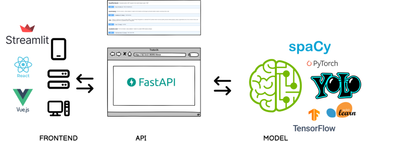
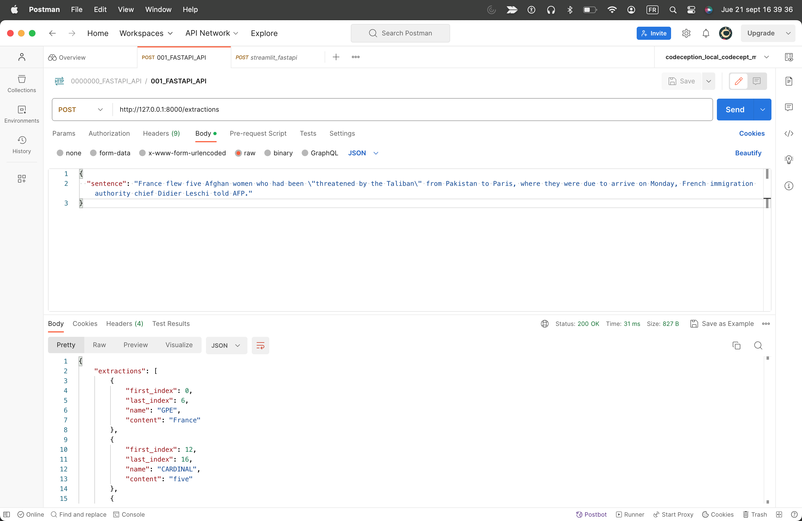
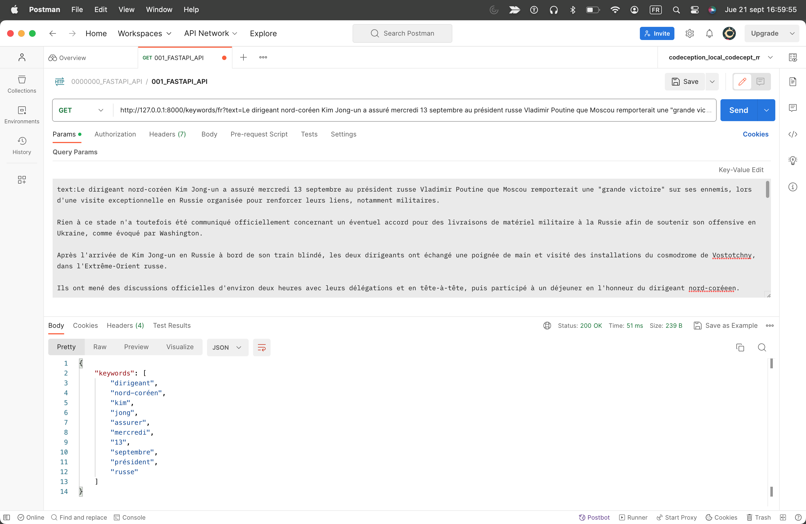
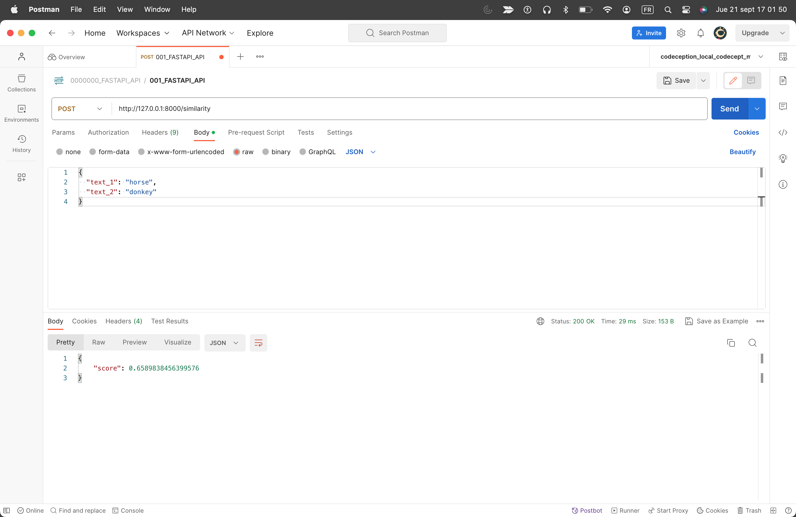

# fastapi_nlp_model

## Intro
An article exploring the ability to build a POC for an API, made with FastAPI. The objective is to expose ML app build & deployment, especially with Spacy.

**You can read the article on my blog**
[How to expose NLP Machine Learning Models mostly for Spacy by quickly building an API with FastAPI and then play with them](https://flaven.fr/2023/09/how-to-expose-nlp-machine-learning-models-mostly-for-spacy-by-quickly-building-an-api-with-fastapi-and-then-play-with-them/)

**Note**
So, I have browse many projects especially those made with Spacy. The last one "017_chatGPT_fastapi_nlp_model" is one made both with the help of ChatGPT and the result of this exploration.

Here is the prompt below the "017_chatGPT_fastapi_nlp_model" project
> Write in python with the best practices a FastAPI that enable 4 languages with Spacy and provide four differents endpoints like summary function, "normal" NER function and “custom” NER function.

## FastAPI Projects Digest
**Here are a quick description per GitHub directory.**

<ul>

<li>002_bamimoretomi_spacy_fastapi: An API's POC with FastAPI using libraries for NLP like NTLTK for text, in english only, with endpoints on similarity, synonyms, antonyms... And a endpoint "tospeech" that convert a text into audio with the library gTTS.</li>

<li>003_juliensalinas_spacy_fastapi: A quick POC on Spacy from the founder of nlpcloud.com, that has evidently leverage on FastAPI.</li>

<li>004_shanealynn_spacy_fastapi: A simple POC on Spacy and Flair.</li>

<li>006_analyticsindiamag_spacy_fastapi: Very similar to the project 003.</li>

<li>008_anaconda_MKTR-ai_YT_Maj9v-Ev7-4: A great video on Youtube with excellent explanations from a real professional. The project was initially using Poetry, I have used Anaconda but I gave the poetry file configuration and I just took the FastAPI API file. A must-seen as the video has its purpose is to go through a super quick ML app build & deployment.  You can see in cation a possible full workflow: from building to deploying an NLP / Machine Learning App with Poetry, FastAPI, Docker, Spacy & GCP. </li>

<li>009_streamlit_fastapi_basic_calculator: A very simple, educational and hybrid project that demonstrate how-to create an API with FastAPI (backend) that will backed a web app made with Streamlit. Nice source of inspiration and a basic illustration of the FRONTEND, API, MODEL workflow.</li>

<li>010_spacy_projects: A more "advanced" API made with FastAPI taken from projects/integrations/fastapi/ in the explosion githib account, the company behind Spacy. See the full project <a href="https://github.com/explosion/projects/tree/v3/integrations/fastapi" target="_blank" rel="noopener">https://github.com/explosion/projects/tree/v3/integrations/fastapi</a></li>

<li>011_cookiecutter_spacy_fastapi: I only grab the API and the test (pytest) from this project. In reality, it is a bit more extended project, made by Microsoft's people to promote Azure platform, using cookiecutter. Here is the full description of the initial project: "A python cookiecutter API for quick deployments of spaCy models with FastAPI. The API interface is compatible with Azure Search Cognitive Skills."</li>

<li>012_fastapi_tiangolo_testing: A sample to explore a bit more the testing. Quality is key. I have follow only the beginning just to ensure that testing with FastAPI  was easy. Extracted from "FastAPI Tutorial - User Guide - Testing" found at 
<a href="https://github.com/explosion/projects/tree/v3/integrations/fastapi" target="_blank" rel="noopener">https://fastapi.tiangolo.com/tutorial/testing/</a>
</li>

<li>013_fastapi_datacamp: Great article, Great source code, found at 
<a href="https://www.datacamp.com/tutorial/introduction-fastapi-tutorial" target="_blank" rel="noopener">https://www.datacamp.com/tutorial/introduction-fastapi-tutorial</a>. Gave a quick comparison between Django, Flask and FastAPI and also provide a good introduction to PyCaret "An open-source, low-code machine learning library in Python"</li>

<li>014_fastapi_kinsta: A different kind of API that explore CRUD operations on Users, nothing to do with NLP! But this project gave precious advices on Routing, Code API logical organisation and so on.</li>

<li>017_chatGPT_fastapi_nlp_model: I already mention this POC. The files are a mix between logical code written by ChatGPT (I have given the prompt in the main.py) and then extended by myself with the code grabbed during this exploration. The API has serve as a base for a presentation to expose ML app build & deployment in my company. It illustrate my belief "A pseudo product must always exist to become the very subject of discussion".</li>

</ul>

## Additional Resources

**A very basic workflow with the FastAPI's API future place (ml_fastapi_front_schema_small.png)**

**Some capture screens to remember how to query an API made with FastAPI via postman this new API :) I always forget it.**

## Videos
TODO require extra time :)