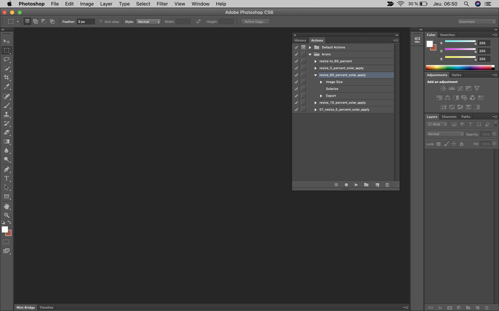

# Scripting with Photoshop or imagemagick to manipulate images


If your image sources are big, even more too big e.g. 4032×3024 in pixels. You need to resize to 10% of the size of the image for 403×302. A size that is good for web publication for instance.

The idea is to use a photosphop script with the help of an applescript to execute bulk operation of resize or you can use also imagemagick to convert your images in a bulk way. With Photoshop, you have the advantage to leverage on the know-how of a graphic designer that may do some more complex image reprocessing.

*For imagemagick, you can even think about using and install a dedicated Docker machine with imagemagick docker for manipulating images or a dedicated Docker machine with mencoder docker for manipulating videos.*


## Using photoshop
Let's start by using photoshop. We will use an action named `resize_10_percent_solar_apply`, these actions resize to 10% and apply a solar effect on each image. Why a solar effect? Because, when testing, I want to see at a glance that the treatment was made!

**Example of AppleScript manipulating actions from Photoshop**

``` applescript
(*
Made for ZNBC (https://znbc.com) to process images in batch with photoshop
*)
(*
 Description: Description: You have to create a script in Photoshop then all the files presented in the source folder will be proceeded with actions you have made in the script and be saved in the destination folder. For the moment the photoshop script executed is "resize_60_percent_solar_apply" from a directory named "bruno". 

 ! CAUTION !
 - Name for script and directory in Photoshop are case-sensitive.
 - Do not register a save action and close action in your Photoshop script.

 Version: 1.1
 Author: Bruno Flaven
 Author URI: http://flaven.fr
 *)

-- This chooses the master folder where all your sub folders with images are stored
say "Choose your Master Folder for this batch job" using "Albert"
set raw_folder to choose folder

-- This chooses the destination folder where all your result images are stored
say "Choose your destination Folder for the processed files" using "Albert"
set live_folder to choose folder


-- This checks when the batch started and stores the date value
set startTime to time of (current date)


(* for actions *)
-- This the file counter
set fileCounter to 0

tell application "Finder"
    set itemList to files in raw_folder
end tell

repeat with j from 1 to (number of itemList)
    set fileCounter to fileCounter + 1
end repeat

(* for fileCounter *)


(* for fileCounter *)
--source and destination folders for the images
tell application "Finder"
    set imageSet to get every file of folder raw_folder
end tell

tell application "Finder"
    repeat with i from 1 to (count of imageSet)
        -- coerce Finder style path to string
        set currentImg to (item i of imageSet) as string
        tell application "Adobe Photoshop CS6"
            -- no dialog box
            set display dialogs to never
            activate
            open alias currentImg
            set currentImg to current document
            -- tell current document
            
            
            -- choose your action in the folder case sensisitive
            do action "resize_10_percent_solar_apply" from "bruno"
            -- do action "resize_60_percent_solar_apply" from "bruno"
            -- do action "resize_60_percent_solar_apply" from "bruno"
            -- do action "02_resize_5_percent_solar_apply" from "bruno"
            -- do action "03_resize_10_percent_robert_joshua_apply" from "bruno"
            
            
            -- close the file in photoshop after the job is done
            close every document without saving
            
        end tell
    end repeat
    
    (* for actions *)
    set endTime to time of (current date)
    
    (* end *)
    say "The job is done, please have a look to the destination folder. The operation took  " & endTime - startTime & " seconds. The directory contains " & fileCounter & " files." using "Victoria"
    
    (* Dialog box if needed *)
    -- display dialog "nThe operation took  " & endTime - startTime & " seconds" & ".nThe directory contains " & fileCounter & " files.n"
    
end tell
```


**With the applescript we want to manipulate are in actions e.g `resize_10_percent_solar_apply` in `bruno`.**


## Using imagemagick
You can easily install imagemagick if you have already homebrew or you may think also creating a container with docket including imagemagick

``` bash
brew doctor
brew update
brew install imagemagick
```

**Example of script using imagemagick**
``` shell
#!/bin/bash
# cd /path-to-your-directories/
# sh resize_images_1.sh


### --- VALUES for source and destination folders, you need to create them! --- ###
SOURCE_DIRNAME="$PWD/01_source/"
DESTINATION_DIRNAME="$PWD/02_destination/"


echo "\n"
echo "\033[1;33m ### START ### \033[0m"
echo "\n"

    # V1
    echo "\033[01;31m #COPY AND CONVERT FILES \033[0m"
    echo "\n"
        for file in "$SOURCE_DIRNAME"*; do
          # echo ${file##*/}
        fileNameOnly=${file##*/} $a
          #printf "Resize $file\n"
            
            # DEBUG
            # printf "SOURCE => $file"
            # printf "fileNameOnly => $fileNameOnly"
            
            # printf "DESTINATION_DIRNAME => $DESTINATION_DIRNAME"
        
            # printf "DESTINATION_DIRNAME with files => $DESTINATION_DIRNAME$fileNameOnly"
            # printf "cp $file $DESTINATION_DIRNAME$fileNameOnly"
            # echo "\n"
            

            # PERFORM ACTION COPY
            # cp $file $DESTINATION_DIRNAME$fileNameOnly
            
            # PERFORM ACTION CONVERT IMAGEMAGICK
        
            # printf "ACTION convert "$file" -resize 10% -gravity center -crop 50%%\! "$DESTINATION_DIRNAME$fileNameOnly" "
            # echo "\n"
            # convert "$file" -resize 10% -gravity center -crop 50%\! "$DESTINATION_DIRNAME$fileNameOnly"
            # echo "\n"


            # convert "$file" -resize 10% -gravity center "$DESTINATION_DIRNAME$fileNameOnly"
            
            
            convert "$file" -thumbnail 200x -gravity center "$DESTINATION_DIRNAME$fileNameOnly"

            # DONE  
            printf "DONE for $DESTINATION_DIRNAME$fileNameOnly"
            echo "\n"
          
        done
    echo "\n"

### ---  DONE --- ###
echo "\033[1;33m ### END IT IS DONE !!! ### \033[0m"
echo "\n"
echo "\033[1;33m ### Check $DESTINATION_DIRNAME ### \033[0m"
echo "\n\n"
exit 0;
```

## Ressources

**For imagemagick.**

- Docker install of imagemagick in Alpine Linux<br><a href="https://hub.docker.com/r/v4tech/imagemagick/" target="_blank">https://hub.docker.com/r/v4tech/imagemagick/</a>

- ImageMagick - Resize all images in a directory<br><a href="https://gordonlesti.com/imagemagick-resize-all-images-in-a-directory/" target="_blank">https://gordonlesti.com/imagemagick-resize-all-images-in-a-directory/</a>


- Simple Docker image for hustle-free image conversions with ImageMagick<br><a href="https://github.com/madhead/imagemagick" target="_blank">https://github.com/madhead/imagemagick</a>


- Simple Alpine image using ImageMagick library<br><a href="https://github.com/rafffael/docker-imagemagick" target="_blank">https://github.com/rafffael/docker-imagemagick</a>

- Examples of ImageMagick Usage (Version 6)<br><a href="http://www.imagemagick.org/Usage/" target="_blank">http://www.imagemagick.org/Usage/</a>

- ImageMagick - Resize all images in a directory<br><a href="https://gordonlesti.com/imagemagick-resize-all-images-in-a-directory/" target="_blank">https://gordonlesti.com/imagemagick-resize-all-images-in-a-directory/
</a>


- Efficient Image Resizing With ImageMagick<br> <a href="https://www.smashingmgazine.com/2015/06/efficient-image-resizing-with-imagemagick/" target="_blank">https://www.smashingmagazine.com/2015/06/efficient-image-resizing-with-imagemagick/</a>

- unix-color-codes.sh<br><a href="https://github.com/ryanoasis/public-bash-scripts/blob/master/unix-color-codes.sh" target="_blank">https://github.com/ryanoasis/public-bash-scripts/blob/master/unix-color-codes.sh</a>


- Git shell coloring
<br><a href="https://gist.github.com/vratiu/9780109" target="_blank">https://gist.github.com/vratiu/9780109</a>

**For Photoshop Scripting.**

- The Art of AppleScript<br><a href="http://theartofapplescript.com/command/photoshop/exports" target="_blank">http://theartofapplescript.com/command/photoshop/exports</a>


- Use AppleScript to batch export Illustrator files to JPG<br><a href="https://gielberkers.com/use-applescript-batch-export-illustrator-files-jpg/
" target="_blank">https://gielberkers.com/use-applescript-batch-export-illustrator-files-jpg/</a>


- Use Photoshop’s Batch Command to Quickly Save Images for Web<br><a href="https://medium.com/stirtingale/use-photoshops-batch-command-to-quickly-save-images-for-web-2e4f2fe2fb8e" target="_blank">https://medium.com/stirtingale/use-photoshops-batch-command-to-quickly-save-images-for-web-2e4f2fe2fb8e</a>

- Adobe Photoshop Scripting<br><a href="http://www.adobe.com/devnet/photoshop/scripting.html" target="_blank">http://www.adobe.com/devnet/photoshop/scripting.html</a>

- Introduction to AppleScript Overview<br><a href="https://developer.apple.com/library/mac/#documentation/AppleScript/Conceptual/AppleScriptX/AppleScriptX.html" target="_blank">https://developer.apple.com/library/mac/#documentation/AppleScript/Conceptual/AppleScriptX/AppleScriptX.html</a>

- Automation sur mac.tutsplus.com<br><a href="http://mac.tutsplus.com/category/tutorials/automation/" target="_blank">http://mac.tutsplus.com/category/tutorials/automation/</a>

- 17 AppleScripts You Should Try<br><a href="http://www.maclife.com/article/howtos/17_applescripts_you_should_try" target="_blank">http://www.maclife.com/article/howtos/17_applescripts_you_should_try</a>

- Introduction to Scripting Photoshop<br><a href="http://www.mactech.com/articles/mactech/Vol.22/22.08/ScriptingPhotoshop/index.html" target="_blank">http://www.mactech.com/articles/mactech/Vol.22/22.08/ScriptingPhotoshop/index.html</a>


