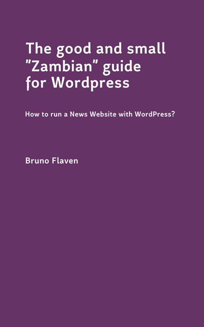
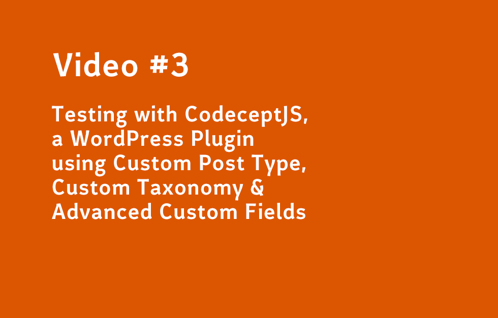

<a id="top"></a>
# Markdown memo for a "Goldfish Memory" with buffer full
So here is the principles cute-and-paste that I am awlays looking as I have a Goldfish memory for everything, including markdown.


**The memo is a copycat of the excellent memo done by Adam Pritchard aka adam-p from [https://crypti.cc/](https://crypti.cc/). Thanks Adam for the work you have done!**

[Markdown Cheatsheet- List of all the markdown](https://github.com/adam-p/markdown-here/wiki/Markdown-Cheatsheet)


## Table of Contents
- <a href="#markdown_1">Headers</a>
- <a href="#markdown_2">Emphasis</a>
- <a href="#markdown_3">Lists</a>
- <a href="#markdown_4">Links</a>
- <a href="#markdown_5">Images</a>
- <a href="#markdown_6">Code and Syntax Highlighting</a>
- <a href="#markdown_7">Tables</a>
- <a href="#markdown_8">Blockquotes</a>
- <a href="#markdown_9">Horizontal Rule</a>
- <a href="#markdown_10">Youtube Video</a>
- <a href="#markdown_11">Directory tree</a>
- <a href="#markdown_12">ASCII Art</a>

<a id="markdown_1"></a>
### Headers <a href="#top">&#8593;</a>
The classic headers to structure your thoughts and your readme at the same time. Ordnung ist das halbe leben

```
# H1
## H2
### H3
#### H4
##### H5
###### H6
Alternatively, for H1 and H2, an underline-ish style:

Alt-H1
======

Alt-H2
------
```

# H1
## H2
### H3
#### H4
##### H5
###### H6
Alternatively, for H1 and H2, an underline-ish style:

Alt-H1
======

Alt-H2

<a id="markdown_2"></a>
### Emphasis <a href="#top">&#8593;</a>

Nothing to add to this. It is just to benefit from basic layout with markdown.

*Directly cut and paste from [Markdown Cheatsheet- List of all the markdown](https://github.com/adam-p/markdown-here/wiki/Markdown-Cheatsheet) by Adam Pritchard aka adam-p from memo [https://crypti.cc/](https://crypti.cc/). Thanks Adam for the work you have done!*


```
Emphasis, aka italics, with *asterisks* or _underscores_.

Strong emphasis, aka bold, with **asterisks** or __underscores__.

Combined emphasis with **asterisks and _underscores_**.

Strikethrough uses two tildes. ~~Scratch this.~~
Emphasis, aka italics, with asterisks or underscores.

Strong emphasis, aka bold, with asterisks or underscores.

Combined emphasis with asterisks and underscores.

Strikethrough uses two tildes. Scratch this.
```

Emphasis, aka italics, with *asterisks* or _underscores_.

Strong emphasis, aka bold, with **asterisks** or __underscores__.

Combined emphasis with **asterisks and _underscores_**.

Strikethrough uses two tildes. ~~Scratch this.~~
Emphasis, aka italics, with asterisks or underscores.

Strong emphasis, aka bold, with asterisks or underscores.

Combined emphasis with asterisks and underscores.

Strikethrough uses two tildes. Scratch this.

<a id="markdown_3"></a>
### Lists <a href="#top">&#8593;</a>

*Directly cut and paste from [Markdown Cheatsheet- List of all the markdown](https://github.com/adam-p/markdown-here/wiki/Markdown-Cheatsheet) by Adam Pritchard aka adam-p from memo [https://crypti.cc/](https://crypti.cc/). Thanks Adam for the work you have done!*

(In this example, leading and trailing spaces are shown with with dots: ⋅)

```
1. First ordered list item
2. Another item
  * Unordered sub-list. 
1. Actual numbers don't matter, just that it's a number
  1. Ordered sub-list
4. And another item.

   You can have properly indented paragraphs within list items. Notice the blank line above, and the leading spaces (at least one, but we'll use three here to also align the raw Markdown).

   To have a line break without a paragraph, you will need to use two trailing spaces.  
   Note that this line is separate, but within the same paragraph.  
   (This is contrary to the typical GFM line break behaviour, where trailing spaces are not required.)
* Unordered list can use asterisks
- Or minuses
+ Or pluses
```

1. First ordered list item
2. Another item
  * Unordered sub-list. 
1. Actual numbers don't matter, just that it's a number
  1. Ordered sub-list
4. And another item.

   You can have properly indented paragraphs within list items. Notice the blank line above, and the leading spaces (at least one, but we'll use three here to also align the raw Markdown).

   To have a line break without a paragraph, you will need to use two trailing spaces.  
   Note that this line is separate, but within the same paragraph.  
   (This is contrary to the typical GFM line break behaviour, where trailing spaces are not required.)
* Unordered list can use asterisks
- Or minuses
+ Or pluses

<a id="markdown_4"></a>
### Links

Same. Thanks Adam for [Markdown Cheatsheet- List of all the markdown](https://github.com/adam-p/markdown-here/wiki/Markdown-Cheatsheet).

There are two ways to create links.

```
[I'm an "egotic" inline-style link](https://www.flaven.fr)

[I'm an "egotic" inline-style link](https://www.flaven.fr "My website")

[I'm a reference-style link][Arbitrary case-insensitive reference text]

[I'm a relative reference to a repository file](../blob/master/LICENSE)

[You can use numbers for reference-style link definitions][1]

Or leave it empty and use the [link text itself].

URLs and URLs in angle brackets will automatically get turned into links. 
https://www.flaven.fr or <https://www.flaven.fr> and sometimes 
example.com (but not on Github, for example).

Some text to show that the reference links can follow later.

[arbitrary case-insensitive reference text]: https://www.flaven.fr
[1]: http://slashdot.org
[link text itself]: https://www.flaven.fr
```

[I'm an "egotic" inline-style link](https://www.flaven.fr)

[I'm an "egotic" inline-style link](https://www.flaven.fr "My website")

[I'm a reference-style link][Arbitrary case-insensitive reference text]

[I'm a relative reference to a repository file](../blob/master/LICENSE)

[You can use numbers for reference-style link definitions][1]

Or leave it empty and use the [link text itself].

URLs and URLs in angle brackets will automatically get turned into links. 
https://www.flaven.fr or <https://www.flaven.fr> and sometimes 
example.com (but not on Github, for example).

Some text to show that the reference links can follow later.

[arbitrary case-insensitive reference text]: https://www.flaven.fr
[1]: http://slashdot.org
[link text itself]: https://www.flaven.fr

<a id="markdown_5"></a>
### Images
The reference here is different. Here is an image with a link and an alt message for the image:

```
[](https://www.amazon.com/dp/B08645F8DZ/)

```

[](https://www.amazon.com/dp/B08645F8DZ/)


<a id="markdown_6"></a>
### Code and Syntax Highlighting

Le truc le meixu du Markdown, le syntax highlighting qui eclaire parfois un code cryptic.

```
Inline `code` has `back-ticks around` it.
```

Inline code has back-ticks around it.


I only use the three back-ticks ``` and add the language if required e.g 
```

```php
```ruby #use it for gherkin feature
```javascript

```

**ruby but use for gherkin feature**
``` ruby
# testing the baseline on the frontoffice
Feature: Checking website made with WordPress
In order to make sure this is a WordPress installation
As a user
I need to see the default WordPress site description

  Background:
    Given I have a WordPress installation
  
  Scenario: A user access to the WP website (frontoffice)
     When I go to "/"
     Then I should be on the homepage
      And I should see "Just another WordPress site"
  
  # testing the login in the backoffice
  Feature: Login into WP admin
  In order to login into the WP admin (backoffice)
  As an valid user
  I need to know my credentials
  
  Background:
    Given I have a WordPress installation
      | email          | username | password |
      | admin@test.com | admin    | admin    |
      And I am logged in as "admin" with password "admin"
  
  Scenario: A valid user access to the platform
     When I go to "/"
      And I fill in "user_login" with "admin"
      And I fill in "pwd" with "admin"
      And I press "Log In"
     Then I should be on the "Dashboard" page
      And I should see "Dashboard"
      And I should see "Howdy, admin"

```

**php**
``` php
class FirstCest
{
    public function _before(AcceptanceTester $I)
    {
    }

    // tests
    public function tryToTest(AcceptanceTester $I)
    {
    }
}
```

**javascript**
```javascript
exports.config = {
  tests: './*_test.js',
  output: './output',
  helpers: {
    Puppeteer: {
      // url: 'http://localhost',
      url: 'http://codecept.mydomain.priv/wordpress/',
      show: true
    }
  },
  include: {
    I: './steps_file.js'
  },
  bootstrap: null,
  mocha: {},
  name: '_discovering_codeceptjs_2'
}
```

**html**
``` html
<!--
I select the option "Copy selector"
I got the CSS selector for the default WP site description
"Just another WordPress site"

CSS selector for site description: #masthead > div > div > p
*/

/*
I select the option "Copy Xpath"
I got the XPATH selector for the the default WP site description
"Just another WordPress site"

XPATH selector for site description: //*[@id="masthead"]/div/div/p

 -->

<!-- extract from the Twenty Nineteen theme 1.4 -->
<div class="site-branding">

                                <h1 class="site-title"><a href="http://codecept.mydomain.priv/wordpress/" rel="home">codecept_test_site</a></h1>
            
                <p class="site-description">
                Just another WordPress site         </p>
            </div>
```

```
No language indicated, so no syntax highlighting in Markdown Here (varies on Github). 
But let's throw in a <b>tag</b>.
```


<a id="markdown_7"></a>
### Tables
Nice to make table to present in columns and rows. Like a a table in HTML.


```
Colons can be used to align columns.

| Source               | Abbreviation  | Filename                          |
| -------------        | ------------- | -------------                     |
| WordpressFrontOffice | WpFront       | WpFrontCest.php                   |
| WordpressBackOffice  | WpBack        | WpBackCest.php or WpAdminCest.php |

```

Colons can be used to align columns.

| Source               | Abbreviation  | Filename                          |
| -------------        | ------------- | -------------                     |
| WordpressFrontOffice | WpFront       | WpFrontCest.php                   |
| WordpressBackOffice  | WpBack        | WpBackCest.php or WpAdminCest.php |

<a id="markdown_8"></a>
### Blockquotes
Not my favorite, but useful sometimes.

```
> Blockquotes are very handy in email to emulate reply text.
> 
> S'éprouver dans l’injonction à parler de soi est une manière d’obéir.
> 
> **Michel Foucault**

Quote break.

> "*Traitez les gens comme s'ils étaient ce qu'ils pourraient être et vous les aiderez à devenir ce qu'ils sont capables d'être.*" **Goethe**


> Kish mir in tushis! __Herr Kartoffel Kopf__

> _Il s'est marié par raison et est tombé amoureux de son argent_ **Un ami lucide**
> 

```


> Blockquotes are very handy in email to emulate reply text.
> 
> S'éprouver dans l’injonction à parler de soi est une manière d’obéir.
> 
> **Michel Foucault**

Quote break.

> "*Traitez les gens comme s'ils étaient ce qu'ils pourraient être et vous les aiderez à devenir ce qu'ils sont capables d'être.*" **Goethe**


> Kish mir in tushis! __Herr Kartoffel Kopf__

> _Il s'est marié par raison et est tombé amoureux de son argent_ **Un ami lucide**
> 
 
<a id="markdown_9"></a>
### Horizontal Rule
Useless to me, found it ugly too in HTML and so in markdown but I cannot pretend that I did use it!

---

Hyphens

***

Asterisks

___

Underscores

```

---

Hyphens

***

Asterisks

___

Underscores
```


<a id="markdown_10"></a>
### YouTube Videos
I have discovered this chunk and it is useful. As nobody read anymore but rather spoil their time on YouTube, adults and kids included. You’d better know how to make video.

```
- [Video #3 Testing Post creation with Tags & Categories](https://www.youtube.com/watch?v=Iixub4_aiLM)
[](https://www.youtube.com/watch?v=Iixub4_aiLM)
```

- [Video #3 Testing Post creation with Tags & Categories](https://www.youtube.com/watch?v=Iixub4_aiLM)
[](https://www.youtube.com/watch?v=Iixub4_aiLM)

<a id="markdown_11"></a>
### Directory tree
This one I like the most with color coding or syntax highlight.

``` bash
.
├── 1_Pioneer_or_Basic_Level # Chapter 1
│   ├── wordpress
│   │    ├── tests
│   │    │    ├── _data
│   │    │    ├── _output
│   │    │    ├── _support
│   │    │    ├── acceptance
│   │    │    ├── functional
│   │    │    ├── unit
│   │    │    ├── acceptance.suite.yml
│   │    │    ├── functional.suite.yml
│   │    │    └── unit.suite.yml
│   │    ├── codeception.yml  
│   │    └── composer.json
│   └── 1_Pioneer_or_Basic_Level.md # all commands used in this chapter
│
├── 2_Settler_advanced_level # Chapter 2
│   ├── wordpress
│   │    ├── tests
│   │    │    ├── _data
│   │    │    ├── _output
│   │    │    ├── _support
│   │    │    ├── acceptance
│   │    │    │     ├──BackCest.php
│   │    │    │     ├──CheckWpBackAddAJournalistProfileCest.php
│   │    │    │     ├──CheckWpBackAddPostCategoryCest.php
│   │    │    │     ├──CheckWpBackAddPostTagCest.php
│   │    │    │     ├──CheckWpBackCest.php
│   │    │    │     ├──CheckWpBackCreateAdvancedPostCest.php
│   │    │    │     ├──CheckWpBackCreateAdvancedPostPlusCest.php
│   │    │    │     ├──CheckWpBackCreatePostCest.php
│   │    │    │     ├──CheckWpBackCreateShortcodePostCest.php
│   │    │    │     ├──CheckWpBackDeletePostCategoryCest.php
│   │    │    │     ├──CheckWpBackDeletePostTagCest.php
│   │    │    │     ├──CheckWpBackNewPluginSearchAndInstallPluginsDirectoryCest.php
│   │    │    │     ├──CheckWpBackNewPluginUploadZipInstallCest.php
│   │    │    │     ├──CheckWpBackNewThemeSearchThemesDirectoryCest.php
│   │    │    │     ├──CheckWpBackNewThemeUploadZipInstallCest.php
│   │    │    │     ├──CheckWpBackNewThemeUploadZipInstallPlusCest.php
│   │    │    │     ├──CheckWpBackPluginActivationCest.php
│   │    │    │     ├──CheckWpBackPluginDeactivationCest.php
│   │    │    │     ├──CheckWpBackUploadNewMediaCest.php
│   │    │    │     ├──CheckWpFrontCest.php
│   │    │    │     ├──CheckWpFrontJournalistProfileArchiveDetailsCest.php
│   │    │    │     ├──CheckWpFrontModifyHeaderFooterCest.php
│   │    │    │     ├──CheckWpFrontTargetHomepageCest.php
│   │    │    │     ├──FrontCest.php
│   │    │    │     ├──SuperDuperCest.php
│   │    │    ├── functional
│   │    │    ├── unit
│   │    │    ├── acceptance.suite.yml
│   │    │    ├── functional.suite.yml
│   │    │    └── unit.suite.yml
│   │    ├── codeception.yml  
│   │    └── composer.json
│   └── 2_Settler_advanced_level.md # all commands used in this chapter
│
├── 3_Leader_expert_level # Chapter 3
│   ├── wordpress-codeception-distrib-4 # a distribution for CP only working with WP on MAMP
│   ├── wordpress-codeception-distrib-docker # a distribution with WP in Docker with .env & Makefile
│   └── 3_Leader_expert_level.md # all commands used in this chapter
│
│──  wp_testing_source # The WP used for the testing strategy (db, plugins...etc)
└──  README.md #This file

```

<a id="markdown_12"></a>
### ASCII Art
unnecessary, pointless, needless, superfluous but so cool.
Confined, shut in, I am dreaming of nature... I am a mother nature son in a front of computer!

**Mountains...**
```
.                  .-.    .  _   *     _   .
           *          /   \     ((       _/ \       *    .
         _    .   .--'\/\_ \     `      /    \  *    ___
     *  / \_    _/ ^      \/\'__        /\/\  /\  __/   \ *
       /    \  /    .'   _/  /  \  *' /    \/  \/ .`'\_/\   .
  .   /\/\  /\/ :' __  ^/  ^/    `--./.'  ^  `-.\ _    _:\ _
     /    \/  \  _/  \-' __/.' ^ _   \_   .'\   _/ \ .  __/ \
   /\  .-   `. \/     \ / -.   _/ \ -. `_/   \ /    `._/  ^  \
  /  `-.__ ^   / .-'.--'    . /    `--./ .-'  `-.  `-. `.  -  `.
@/        `.  / /      `-.   /  .-'   / .   .'   \    \  \  .-  \%
@&8jgs@@%% @)&@&(88&@.-_=_-=_-=_-=_-=_.8@% &@&&8(8%@%8)(8@%8 8%@)%
@88:::&(&8&&8:::::%&`.~-_~~-~~_~-~_~-~~=.'@(&%::::%@8&8)::&#@8::::
`::::::8%@@%:::::@%&8:`.=~~-.~~-.~~=..~'8::::::::&@8:::::&8:::::'
 `::::::::::::::::::::::::::::::::::::::::::::::::::::::::::::.'
```

**or Sea**
```
              ,.  _~-.,               .
           ~'`_ \/,_. \_
          / ,"_>@`,__`~.)             |           .
          | |  @@@@'  ",! .           .          '
          |/   ^^@     .!  \          |         /
          `' .^^^     ,'    '         |        .             .
           .^^^   .          \                /          .
          .^^^       '  .     \       |      /       . '
.,.,.     ^^^             ` .   .,+~'`^`'~+,.     , '
&&&&&&,  ,^^^^.  . ._ ..__ _  .'             '. '_ __ ____ __ _ .. .  .
%%%%%%%%%^^^^^^%%&&;_,.-=~'`^`'~=-.,__,.-=~'`^`'~=-.,__,.-=~'`^`'~=-.,
&&&&&%%%%%%%%%%%%%%%%%%&&;,.-=~'`^`'~=-.,__,.-=~'`^`'~=-.,__,.-=~'`^`'~=
%%%%%&&&&&&&&&&&%%%%&&&_,.;^`'~=-.,__,.-=~'`^`'~=-.,__,.-=~'`^`'~=-.,__,
%%%%%%%%%&&&&&&&&&-=~'`^`'~=-.,__,.-=~'`^`'~=-.,__,.-==--^'~=-.,__,.-=~'
##mjy#####*"'
_,.-=~'`^`'~=-.,__,.-=~'`^`'~=-.,__,.-=~'`^`'~=-.,.-=~'`^`'~=-.,__,.-=~'

~`'^`'~=-.,__,.-=~'`^`'~=-.,__,.-=~'`^`'~=-.,__,.-=~'`^`'~=-.,__,.-=~'`^
```

