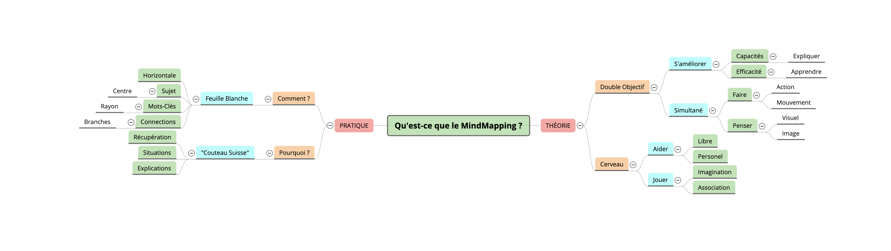
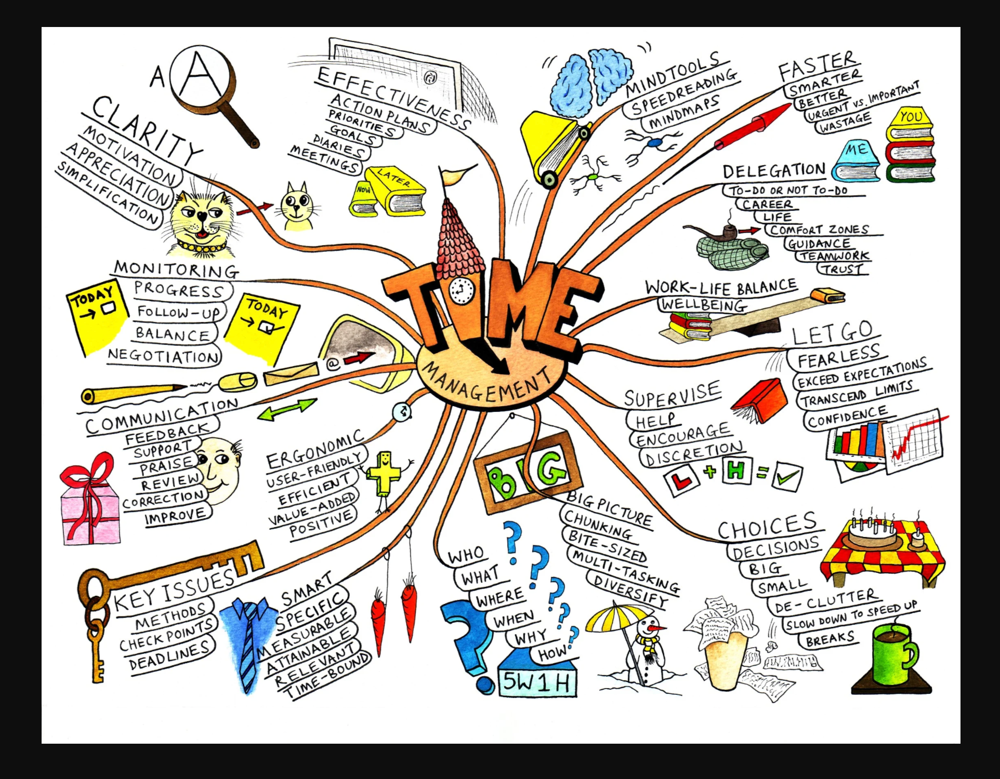
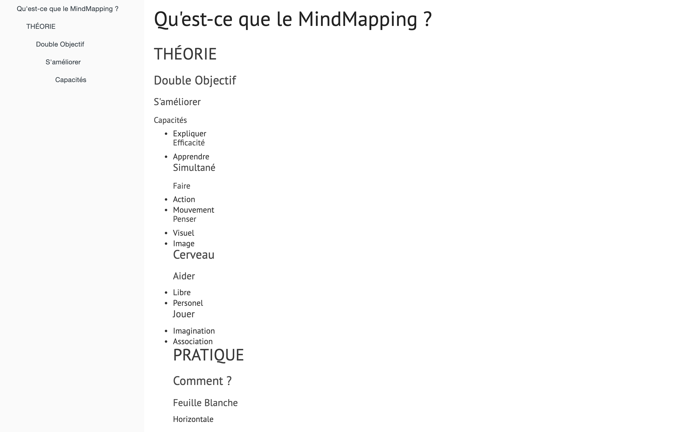
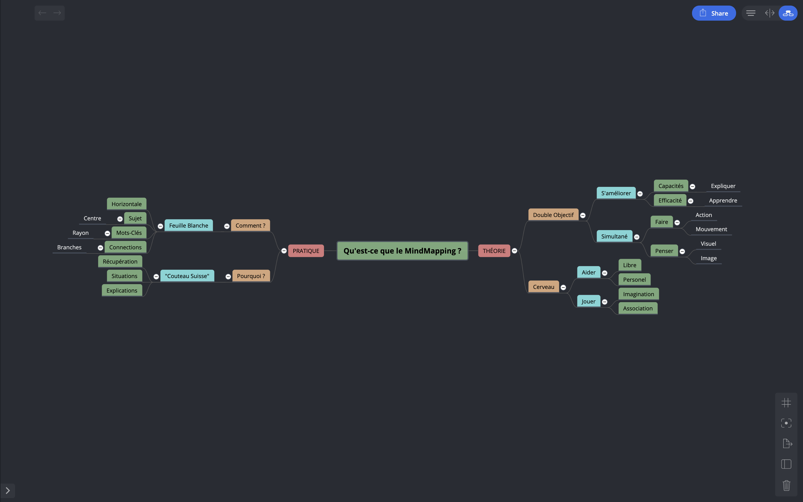
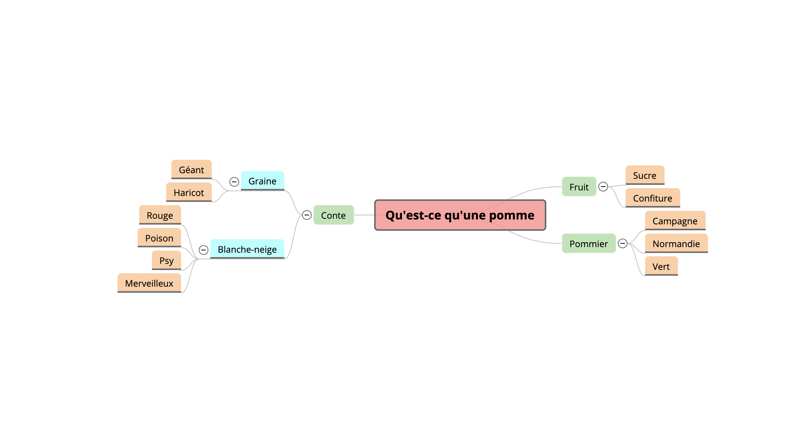

# Mind Mapping, learn better and be more creative with Mind Mapping, a small introduction to Mind Map

Some info about Mind Mapping and practical advice to use it. Tht is the stuff used in the article.

[Mind Mapping, learn better and be more creative with Mind Mapping, a small introduction to Mind Mapping](http://flaven.fr/2020/05/mind-mapping-learn-better-and-be-more-creative-with-mind-mapping-a-small-introduction-to-mind-mapping/)

**Thanks to Prisca for her question on MM.**


## Some take-aways

**mm_by_mm_good.png made with a tool called [Brainio](https://brainio.com/)**
[](http://flaven.fr/2020/05/mind-mapping-learn-better-and-be-more-creative-with-mind-mapping-a-small-introduction-to-mind-mapping/)


**mm_mindmap_nice_example_time_management_good.png: nice association of MM and graphic facilitation. &copy; mindmapsunleashed.com**
[](http://flaven.fr/2020/05/mind-mapping-learn-better-and-be-more-creative-with-mind-mapping-a-small-introduction-to-mind-mapping/)


**ugly_map_good.png: The "ugly" readme file.**
[](http://flaven.fr/2020/05/mind-mapping-learn-better-and-be-more-creative-with-mind-mapping-a-small-introduction-to-mind-mapping/)

## Idea for workshop
**To experiment imagination and association**

**nice_map_inside.png: Even though I am absolute fanatic of readme I must admit that with a MM drawing it is much appealing, I should even say sexy, much more glamourous and quite effective. Made with a tool called [Brainio](https://brainio.com/)**
[](http://flaven.fr/2020/05/mind-mapping-learn-better-and-be-more-creative-with-mind-mapping-a-small-introduction-to-mind-mapping/)


**mm_whatis_apple_mm_brainio.md: The "ugly" readme file that is the source in French of What is an apple? (Qu'est-ce qu'une pomme ?) Good exercise to introduce MM principles: imagination and association. Made with a tool called [Brainio](https://brainio.com/)**

```
# Qu'est-ce qu'une pomme ?
## Fruit
*Sucre
*Confiture
## Pommier
*Campagne
*Normandie
*Vert
## Conte
### Graine
*Géant
*Haricot
### Blanche-neige
*Rouge
*Poison
*Psy
*Merveilleux
```


**mm_whatis_apple_mm.png: What is an apple? (Qu'est-ce qu'une pomme ?) Good exercise to introduce MM principles: imagination and association**
[](http://flaven.fr/2020/05/mind-mapping-learn-better-and-be-more-creative-with-mind-mapping-a-small-introduction-to-mind-mapping/)
