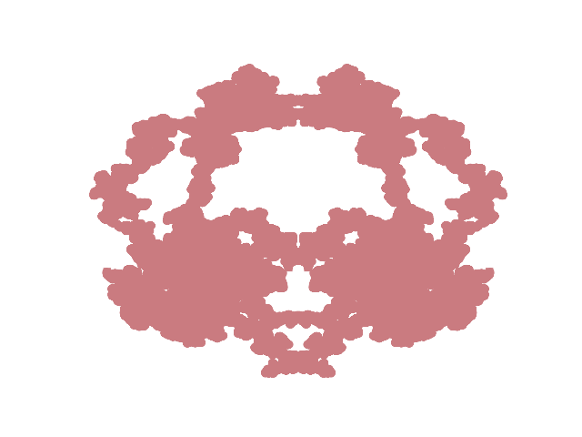

# 008_rorschach_mask_project

### 1. Intro

**My subject is to create what is commonly called Generative Art Collections. It is a new way to create a collection of NFTs with scripts. This process is at the origin of the most popular collections such as CryptoPunks, Bored Ape Yacht Club... I looked for some resources in Python to generate my own collection. Here is a fraction of this search. For those who don't know what an NFT and some other concepts regarding the NFT ecosystem, you can read the article published on my own website [flaven.net](https://flaven.fr/) or you can grab the source for each NFT generator and some other resource on this GitHub account.**

Read the full post on my own website [https://flaven.fr/2022/04/how-to-create-your-own-nft-generative-art-collections-with-python/](https://flaven.fr/2022/04/how-to-create-your-own-nft-generative-art-collections-with-python/)


This NFT generator came from [Island-generator](https://github.com/DavidKohler/Inkblot)

It has also an inspiration in the [Rorschach Test](https://en.wikipedia.org/wiki/Rorschach_test)

*NFT Example generated with 008_rorschach_mask_project*




### 2. What is an NFT?

An NFT is a tokenized digital asset that can be verified on the blockchain and is non-fungible, meaning it is unique and cannot be easily exchanged for a similar asset. NFTs live on the blockchain, a decentralized global computer network that maintains a public record, they cannot be tampered, destroyed, hacked or counterfeited.

### 3. Requirements

**You need to install Python to take advantage of this NFT generator. Here is the way to install Python on a mac with Homebrew**

To install Homebrew, open Terminal or your favorite OS X terminal emulator and run

```bash
/bin/bash -c "$(curl -fsSL <https://raw.githubusercontent.com/Homebrew/install/master/install.sh>)"
```

The script will explain what changes it will make and prompt you before the installation begins. Once you’ve installed Homebrew, insert the Homebrew directory at the top of your PATH environment variable. You can do this by adding the following line at the bottom of your ~/.profile file

```bash
export PATH="/usr/local/opt/python/libexec/bin:$PATH"
```

If you have OS X 10.12 (Sierra) or older use this line instead

```bash
export PATH=/usr/local/bin:/usr/local/sbin:$PATH
```

Now, we can install Python 3:

```bash
brew install python
```

This will take a minute or two.

*Source : [SEO Spider General's User Guide](https://docs.python-guide.org/starting/install3/osx/)*

### 4. Create your environment with Conda

**Go to the dir**

It is just I found easier to be in same git directory to create my environment with Conda.

```bash
# go to your directory
cd /[your-path]/008_rorschach_mask_project
```

**Create your dev env with conda**

```bash

[env]
# Conda Environment
conda create --name nft_insights python=3.9.7
conda info --envs
source activate nft_insights
conda deactivate
# if needed to remove
conda env remove -n [NAME_OF_THE_CONDA_ENVIRONMENT]

```

**Install packages in your dev env**

```bash
# install the packages in the env

# install
pip install pillow
pip install ipython
pip install matplotlib
pip install seaborn
pip install streamlit

```

**Save python requirements in a file name `nft_image_generator_requirements_1.txt`**

```bash

# show what the requirements
pip freeze > nft_image_generator_requirements_1.txt
pip install -r nft_image_generator_requirements_1.txt

```

### 4. Tree directory


```bash
.
├── README.md
├── color_data.py
├── inkblots_mpl.py
├── inkblots_mpl_2.py
├── inkblots_mpl_3.py
├── inkblots_mpl_4.py
├── inkblots_mpl_5.py
├── mask_1_linewidth_6_color_#74a662.png
├── mask_2_linewidth_4_color_#ffff7e.png
├── mask_3_linewidth_4_color_#a00498.png
├── mask_4_linewidth_6_color_#ca7b80.png
├── mask_5_linewidth_4_color_#bd6c48.png
└── rorschach_mask_project_1.py
```


