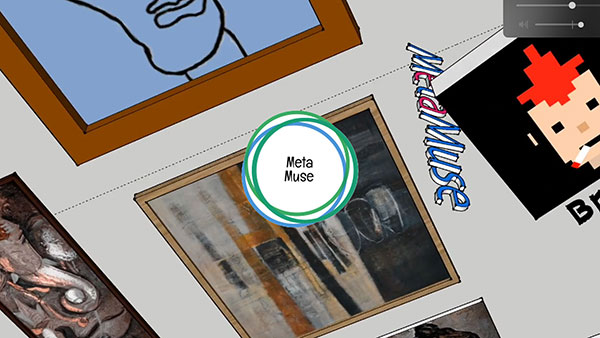
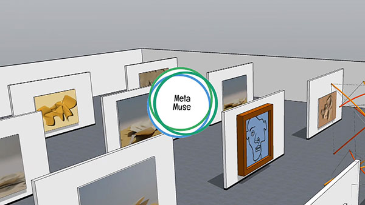
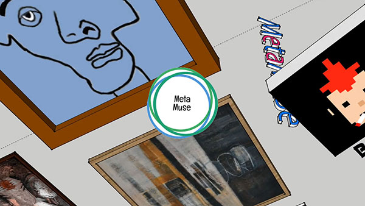
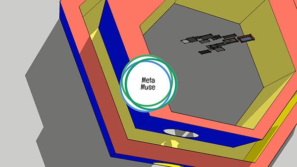

# nft_insights


Recently, I had to take an interest in the metaverse, which obviously seems to be the future of the web aka Web3! Incidentally, it was also an opportunity to discover NFTs and blockchain and even more concretely on how to create my own NFT's collection.

**I looked for some resources in Python to generate my own collection. Here is a fraction of this search. For those who don't know what an NFT and some other concepts regarding the NFT ecosystem below you can get quick definition and links to showcase some of today's most famous collections.**


Read the full post on my own website [https://flaven.fr/2022/04/how-to-create-your-own-nft-generative-art-collections-with-python/](https://flaven.fr/2022/04/how-to-create-your-own-nft-generative-art-collections-with-python/)

## Video using these NFTs

**These 4 videos where made during a workshop for the training for "Management de l’Innovation Technologique" at https://exed.polytechnique.edu/ for a project named MetaMuse. The baseline of the MetaMuse project was to offer to create virtual exhibition spaces or galleries, free and paid, of NFTs in the Metaverse.**

*These videos were made with Sketchup and integrated some NFT created during the Workshop especially one extracted from 007_pycasso_nft_generator*

The code for the #NFT #Generative #Art #Collections is available for a fun discovering on how to create your own #NFT #Generative #Art #Collections with #Python and #streamlit on my Github account at https://bit.ly/3EbWSdd

More attempts are also available for #NFT #Generative #Art #Collections with Frida #Kahlo and Lionel #Messi, Pablo #Picasso and even the #Rorschach Tests.

Read the full post extracted from this experience on my own website at https://wp.me/p3Vuhl-3af

- [MetaMuse Project : The MetaMuse Teaser Experience](https://www.youtube.com/watch?v=hzN8nn8wBVY)
[](https://www.youtube.com/watch?v=hzN8nn8wBVY)


- [MetaMuse Project : The MetaMuse UX Guggenheim Modern Gallery experience](https://www.youtube.com/watch?v=p_FMgTVXxME)
[](https://www.youtube.com/watch?v=p_FMgTVXxME)


- [MetaMuse Project : The MetaMuse Hermitage Museum No Wall Art Gallery experience](https://www.youtube.com/watch?v=yYh1KvsiqgQ)
[](https://www.youtube.com/watch?v=yYh1KvsiqgQ)


- [MetaMuse Project : The MetaMuse Hermitage Museum No Wall Art Gallery experience](https://www.youtube.com/watch?v=kSiDdjE7sdU)
[](https://www.youtube.com/watch?v=kSiDdjE7sdU)


## Git commands memo

**In 2022, I always forget how to push on GitHub**

```bash
# GIT 2022

# hint: suppose you have set a personal access token
# https://docs.github.com/en/authentication/keeping-your-account-and-data-secure/creating-a-personal-access-token


# hint: go to the directory
cd /Users/brunoflaven/Documents/03_git/BlogArticlesExamples/nft_insights

# hint: move the HEAD to the latest commit of the master banch
git checkout master

# hint: You've added another git repository inside your current repository.
# Clones of the outer repository will not contain the contents of
# the embedded repository and will not know how to obtain it.
# If you meant to add a submodule, use:
git submodule add <url> nft_insights/002_NFT_generator

# hint: If you added this path by mistake, you can remove it from the
index with:
git rm --cached nft_insights/002_NFT_generator


# hint: See "git help submodule" for more information.
git submodule add <url> nft_insights/002_NFT_generator


# hint: my dir list
# 001_NFT_training
# 002_NFT_generator
# 002_NFT_generator_streamlit
# 003_nft_image_generator
# 006_nft_nature_article
# 007_pycasso_nft_generator
# 008_rorschach_mask_project
# 009_treasure_island_project
# 010_frida_kahlo_project


# mkdir 006_nft_nature_article
# mkdir 007_pycasso_nft_generator
# mkdir 008_rorschach_mask_project
# mkdir 009_treasure_island_project
# mkdir 010_frida_kahlo_project


# hint: create a subdirectory in the main repository
# mkdir 003_nft_image_generator
# cd 003_nft_image_generator
# touch README.md
# cd ..


# hint: add to Github
git add 001_NFT_training
git add 002_NFT_generator
git add 002_NFT_generator_streamlit
git add 003_nft_image_generator

# series
git add 006_nft_nature_article
git add 007_pycasso_nft_generator
git add 008_rorschach_mask_project
git add 009_treasure_island_project
git add 010_frida_kahlo_project

# hint: know your branch
git branch


# hint: check for status
git status

# hint: for any change just type this command
git add .

# hint: add a commit with a message
git commit -am "remove repo"
git commit -am "add videos"
git commit -am "add repo"
git commit -am "add usecase"
git commit -am "add files"
git commit -am "add massive files"
git commit -am "update files"
git commit -am "update readme"
git commit -am "add repo and add readme"
git commit -am "add repositories 006_nft_nature_article, 007_pycasso_nft_generator 008_rorschach_mask_project, 009_treasure_island_project, 010_frida_kahlo_project"
git commit -am "add repositories 006_nft_nature_article, 007_pycasso_nft_generator 008_rorschach_mask_project, 009_treasure_island_project, 010_frida_kahlo_project; add and update readme"
git commit -am "add files and update readme"
git commit -am "add nft file examples in readme"

# hint: push to Github if your branch on Github is master
git push origin master

```