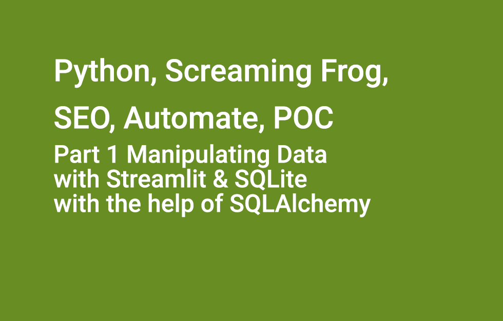
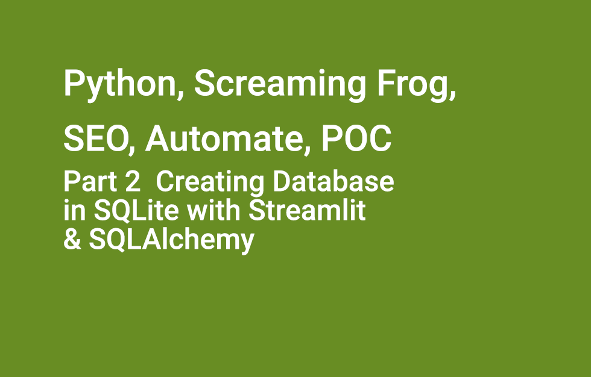
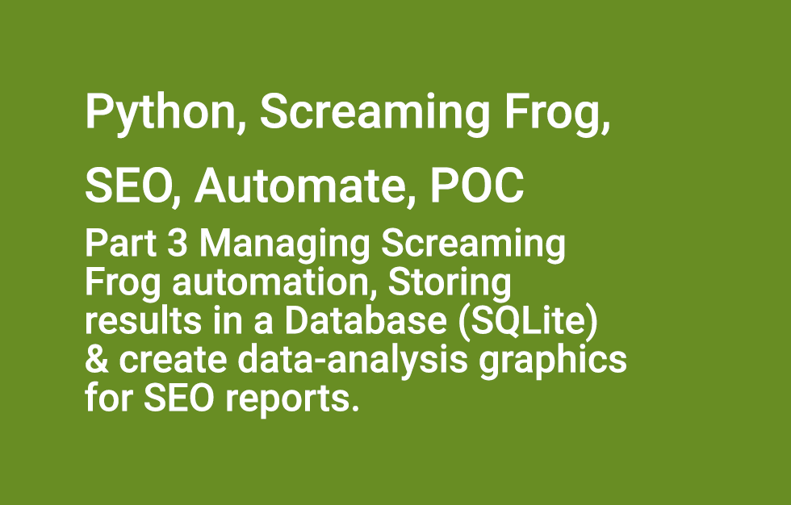

# howto_python_automate_screaming_frog

**The elements extracted for the videos.**

## TITLE
Quick POC for a All-in-one that provides an SEO dashboard made with Streamlit, managing Screaming Frog automation, storing results in a Database (SQLite) and create data-analysis graphics for SEO reports.
*See more on the post at https://wp.me/p3Vuhl-37N*


### PART_1
Simple application_1 :: sqlalchemy_guide_database :: Manipulating Data with Streamlit and SQLite with the help of SQLAlchemy

### PART_2
Simple application_2 :: date_time_sqlite :: Manipulating Data with Streamlit and SQLite with the help of SQLAlchemy


### PART_3
More advanced ::  streamlit_app_crawl_screamingfrog :: Creating an SEO Dashboard made with Streamlit, managing Screaming Frog automation, storing results in a Database (SQLite) and create data-analysis graphics for SEO reports


### URLs
- ARTICLE :: https://wp.me/p3Vuhl-37N
- CODE :: https://bit.ly/3oAPuBP
- WEBSITE http://flaven.net/

### QUICK DESCRIPTION

- OBJECTIVE :: A personal tooling. A "tool" industrialized and automatized to: chain actions between them in order to improve productivity and facilitate decision-making, delegate tedious work to machines in order to give me more free time

- OUPUT :: Dashboard Streamlit, Screaming Frog SEO Spider for large time saves and fast audits then manage the output (csv reports), save it into a SQLite database and analyse it with creating graphics.

- PO :: "improver", "tinker" or "builder" 

### TEK GUIDELINES
- Streamlit https://streamlit.io/
- SQLite https://sqlite.org
- SQLAlchemy https://www.sqlalchemy.org/
- The Screaming Frog SEO https://www.screamingfrog.co.uk/seo-spider/


### PATH CONSOLE
```bash
cd /Users/brunoflaven/Documents/03_git/BlogArticlesExamples/python-automate-screaming-frog-sqlalchemy-streamlit-pandas-plotly/
```


### CONDA ENVIRONMENT
- requirement using conda to manage development environment
- create requirements file for the apps
```bash
pip freeze > automate_screaming_frog_2.txt
```


### USE SQLITE

- connect to sqlite
```bash
sqlite3
```


#### DB_2

- connect to a specific DB
```bash
.open /Users/brunoflaven/Documents/03_git/BlogArticlesExamples/python-automate-screaming-frog-sqlalchemy-streamlit-pandas-plotly/sqlalchemy_guide_database/sqlalchemy_data/streamlit_sqlalchemy_guia_database_example.sqlite3
```
- to show the tables in SQLite
```bash
.tables
```

- to show about the db in SQLite
```bash
.dbinfo
```

- to show the tables with a table named [table_name] in SQLite
```bash
.schema ingredientes
```

- few queries in SQLite
```bash
SELECT * FROM ingredientes;
SELECT COUNT(*) FROM ingredientes;
```

- make a dump
```bash
.output /Users/brunoflaven/Documents/03_git/BlogArticlesExamples/python-automate-screaming-frog-sqlalchemy-streamlit-pandas-plotly/sqlalchemy_guide_database/streamlit_sqlalchemy_guia_database_example.sql
.dump
```

- extra records
```bash
Horse Radish
Orange
Apple Seeds
Lemon
Watermelon
```

#### DB_1

- connect to a specific DB
```bash
.open /Users/brunoflaven/Documents/03_git/BlogArticlesExamples/python-automate-screaming-frog-sqlalchemy-streamlit-pandas-plotly/date_time_sqlite/data/StudentAssignment_1.sqlite3
```

- make a dump
```bash
.output /Users/brunoflaven/Documents/03_git/BlogArticlesExamples/python-automate-screaming-frog-sqlalchemy-streamlit-pandas-plotly/date_time_sqlite/studentassignment_1.sql
.dump
```

- to show the tables in SQLite
```bash
.tables
```

- to show about the db in SQLite
```bash
.dbinfo
```


- to show the tables with a table named [table_name] in SQLite
```bash
.schema ingredientes
```

- few queries in SQLite
```bash
SELECT * FROM assignment;
SELECT COUNT(*) FROM assignment;
```


#### DB_3

- connect to a specific DB
```bash
.open /Users/brunoflaven/Documents/03_git/BlogArticlesExamples/python-automate-screaming-frog-sqlalchemy-streamlit-pandas-plotly/streamlit_app_crawl_screamingfrog/sqlalchemy_data/screamingfrog_websites_crawls_all_new_1.sqlite3
```

- make a dump
```bash
.output /Users/brunoflaven/Documents/03_git/BlogArticlesExamples/python-automate-screaming-frog-sqlalchemy-streamlit-pandas-plotly/streamlit_app_crawl_screamingfrog/screamingfrog_websites_crawls_all_new_1.sql
.dump
```

### UPDATE CONDA
```bash
conda update -n base -c defaults conda

```

### HASHTAGS

>An #experimentation and #POC for #PO about #Automate #ScreamingFrog for #SEO with #pandas, #python, #SQLite, and for sure #Streamlit, https://wp.me/p3Vuhl-37N


### GIT COMMIT
```bash
git status
git add .
git commit -am "add python-automate-screaming-frog-sqlalchemy-streamlit-pandas-plotly"
git commit -am "updates files make it work for video"
git commit -am "change plugin"
git commit -am "change readme"
git push origin master

```

## VIDEOS


[Python, Screaming Frog, SEO, Automate, POC Part 1 Manipulating Data with Streamlit & SQLite with the help of SQLAlchemy](https://www.youtube.com/watch?v=6R0HYHIVVUQ)
[](https://www.youtube.com/watch?v=6R0HYHIVVUQ)


[Python, Screaming Frog, SEO, Automate, POC Part 2 Creating Database in SQLite with Streamlit and SQLAlchemy](https://www.youtube.com/watch?v=i_WrW5-i2wY)
[](https://www.youtube.com/watch?v=i_WrW5-i2wY)


[Python, Screaming Frog, SEO, Automate, POC Part 3 Creating Database in SQLite with Streamlit and SQLAlchemy](https://www.youtube.com/watch?v=PMC36ZGDWQ8)
[](https://www.youtube.com/watch?v=PMC36ZGDWQ8)

