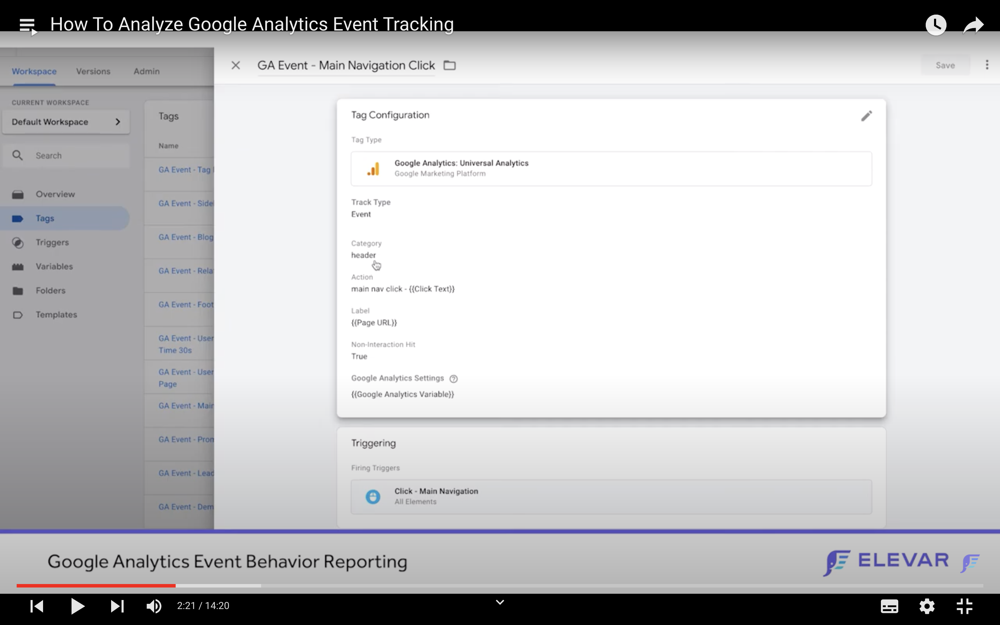

# google_tag_manager_google_analytics


A nitty-gritty analysis of several ressource especially a playlist introducing GOOGLE TAG MANAGER (GTM or GTMA) for eCommerce but the concepts may apply to any website

# 1. WORKING WITH GTMA

## 1.1 Install GTMA

**You must have the script with `<GTM-ID>` for GOOGLE TAG MANAGER (GTM) e.g. `GTM-7E6GZ45`. if you have GA loaded, you must remove the GA tag implemenation and add the one for GTM.**

Init Google Tag Manager V1.0


**Step_1 - Disable Google Analytics**
Remove Google Analytics ID: `UA-<GA-ID>`

**Step_2 - Install Google Tag Manager**
Source: https://developers.google.com/tag-manager/quickstart
You can add gtm to a local dev site or a live one.

1. Copy the code below and paste it onto every page of your website. Paste this code as high in the `<head>` of the page as possible:
```javascript
<!-- Google Tag Manager -->
<script>(function(w,d,s,l,i){w[l]=w[l]||[];w[l].push({'gtm.start':
new Date().getTime(),event:'gtm.js'});var f=d.getElementsByTagName(s)[0],
j=d.createElement(s),dl=l!='dataLayer'?'&l='+l:'';j.async=true;j.src=
'https://www.googletagmanager.com/gtm.js?id='+i+dl;f.parentNode.insertBefore(j,f);
})(window,document,'script','dataLayer','<GTM-ID>');</script>
<!-- End Google Tag Manager -->
```

2. Additionally, paste this code immediately after the opening `<body>` tag:

```javascript
<!-- Google Tag Manager (noscript) -->
<noscript><iframe src="https://www.googletagmanager.com/ns.html?id=<GTM-ID>"
height="0" width="0" style="display:none;visibility:hidden"></iframe></noscript>
<!-- End Google Tag Manager (noscript) -->
```

## 3. Does it work?
- In the console if you need to access to the google_tag_manager type the following command:
```javascript
// type in the console to laod GTM
google_tag_manager;
```


- In the console if you need to access to the dataLayer type the following command:
```javascript
dataLayer;
```

## 4. Example for a WP
Do not tinkering your theme, make a basic plugin!
A quick and dirty plugin that hack any theme to implement GTM or GA. It changes the footer, header and body of WP, use native WP function. Used Namespace and Class. Check directory `ga-gtml-hack-bf`.


Extract from `ga_gtm_hack_bf.php`
```php
// header
add_action( 'wp_head', [ 'GaGtmHackBf\Insert\Models\GaGtmHackBfDisplayHeader', 'ZeFrontendHeader' ] );

// when body is open
add_action( 'wp_body_open', [ 'GaGtmHackBf\Insert\Models\GaGtmHackBfDisplayBody', 'ZeFrontendBody' ] );


// footer
add_action( 'wp_footer', [ 'GaGtmHackBf\Insert\Models\GaGtmHackBfDisplayFooter', 'ZeFrontendFooter' ] );

```


# 2. USING GTM


In an ecommerce site, implementing GTM will enable custom tracking for any action that lead users down to purchase. So, the focus will be on tracking for instance the Checkout Path. Even though you are not running an ecommerce website, you can rely on the best practices and focus described below in each video (naming convention, method, tools...)


**The idea is how to leverage on these best practises,tools and apply them to a general Website Strategy or a Conversion Strategy if you are a ecommerce website.**


## 2.1 Install GA with GTM
How to use the Google Tag Assistant extension to validate Google Analytics Implementation with Google Tag Assistant. See https://www.youtube.com/watch?v=O_FFUw1tSfI

Use the tag assistant companion in Chrome to check the GTM install : https://chrome.google.com/webstore/detail/tag-assistant-companion/jmekfmbnaedfebfnmakmokmlfpblbfdm/related

## 2.2 GTM For eCommerce

Source: https://www.youtube.com/watch?v=lPvWhyw7Keg&list=PLpjwMOKO8Jz5hk4vFsc5hKsOMNLMVHflT&index=1


Remember the 3 KWs before starting with GTMA. The order to start with GTMA is : Tag, Trigger, Variable!


**quick definition for variables:**
Variables is anything can be retrieve uniquely from a website eg price of a product, id of product...

### 2.2.1 Video_2 7 Types of Triggers for Google Tag Manager
Source: https://www.youtube.com/watch?v=osnWOkppXvU&list=PLpjwMOKO8Jz5hk4vFsc5hKsOMNLMVHflT&index=4

```bash
Event Trigger - Specific Page, very useful for conversion
Event Trigger - Timer, very useful for conversion
Event Trigger - Scroll, very useful for conversion
# You can select 10, 25, 50, 75, 90
Event Trigger - Forms, very useful for conversion
Event Trigger - Impression, very useful for conversion
Event Trigger - Video, very useful for conversion
Event Triggers - Click, very useful for conversion
```


### 2.2.2 Video_4 Sources Of Custom Event Data in Google Analytics
! Google Analytics Event Tagging

In GTMA category is called product page 
Event category (big bucket e.g. product)
Event action (unique action e.g. clicking on a specific image in a slideshow to determine which is the more appealing)

What is Slicing and Dicing?
Slicing and Dicing refers to a way of segmenting, viewing and comprehending data in a database.

### 2.2.3 Video_8 :: 3 Ways to Create Click Triggers in Google Tag Manager
- Source: https://www.youtube.com/watch?v=z49SmubDyLI&list=PLpjwMOKO8Jz5hk4vFsc5hKsOMNLMVHflT&index=8


**Click trigger Definition**

- "All Elements": Track clicks on any element on a page, e.g. links, images, buttons, etc.
- "Just Links": Track clicks only on HTML links that use the `<a>` element, e.g. `<a href="www.google.com">Google.com</a>`.

Source: https://support.google.com/tagmanager/answer/7679320?hl=en&ref_topic=7679108

- Example from https://www.youtube.com/watch?v=z49SmubDyLI&list=PLpjwMOKO8Jz5hk4vFsc5hKsOMNLMVHflT&index=7

**Example for Naming convention**

```bash
TAG :: GA Event - Lead Magnet Click
Trigger :: Click - Lead Magnet Click
```

define the rules for this trigger

### 2.2.4 Video_9 :: 5 Real Life Examples of 3rd Party Features to Tag

Source: https://www.youtube.com/watch?v=EukqOblMX5I&list=PLpjwMOKO8Jz5hk4vFsc5hKsOMNLMVHflT&index=9


**How to create an Event into GTMA?**

**Example for Naming convention fo Event**
```bash

#Example_1 Event
Event name :: GA Event - Yotop Review Filter Clicks
Event category for GA :: product page
Event action :: reviews filter click - {{Click Text}}
Event Label :: {{Page URL}}

TODO ::  must find a selector


#Example_2 Event
Event name :: GA Event - Open Modal Click
Event category for GA :: global
Event action :: open modal click
Event Label :: {{Page URL}}

TODO ::  must find a selector


#Example_3 Event
Event name :: GA Event - FOMO Notification
Event category for GA :: product page
Event action :: fomo click - {{Click Text}}
Event Label :: {{Page URL}}

TODO ::  must find a selector


#Example_4 Event
Event name :: GA Event - Currency Selection
Event category for GA :: global
Event action :: currency selection click - {{Click URL}}
Event Label :: {{Page URL}}

TODO ::  must find a selector


#Example_5 Event
Event name :: GA Event - Undertone Quiz Selection Selection
Event category for GA :: quiz
Event action :: undertone click - {{Click Text}}
Event Label :: {{Page URL}}

TODO ::  must find a selector


#MODEL Example_6 Event
Event name :: GA Event - Yotop Review Filter Clicks
Event category for GA :: product page
Event action :: reviews filter click - {{Click Text}}
Event Label :: {{Page URL}}

TODO ::  must find a selector


#MODEL Example_7 Event
Event name :: GA Event - Reset 2FA Click
Event 2FA :: login page
Event action :: open 2FA reset process
Event Label :: {{Page URL}}

TODO ::  must find a selector


#MODEL Example_8 Event
Event name :: GA Event - navigation - Click Text
Event category for GA :: navigation
Event action :: main navifation click - {{Click Text}}
Event Label :: {{Page URL}}

TODO ::  must find a selector
```

**Detail on Built-in Variables**
Note : To activate all kind Built-in Variables.
In your GTM account, go to Variables, and in the Built-in Variables section click Configure. A panel will appear on the left side. Scroll down until you find click variables and enable ALL of them one-by-one, including Click ID, Click URL, etc.

### 2.2.5 Video_9 :: 5 Steps To Tag Your Own Website With Custom Event Tracking


**Objective:**
A process that you can take to evaluate your current site, the questions you want to answer, tagging you site, queuing it and polish it so you can start extracting insights on what users are doing on your site and apply it your own conversion optimization strategy...

 


- **Step #1 : Build a list of events or questions that you want to answer.**


We all have unique features and characteristics about our site so you really have to dig in when you are thinking how to optimize your own site how to move that needle of going of just few percentage points that conversion rate or features you want to remove from the site because you hate them that is not helping users convert or user-experience.

**Just make a excel file with the questions converted into almots GTMA programmation, very basic example.**

```
# Pattern: Site Element, Event category, Event action, Event Label

#example_1
navigation clicks, navigation, main nav click - {{Click Text}}, {{Page URL}}

#example_2
thumbnail images, product page, image gallery right click, {{Page URL}}
```


**Step #2 : Audit what is already tagged on the site ?**

You can check into GA, into Behaviour > Events > Top Events or put GTMA in preview mode.

The best way is to use the Google Analytics Debugger.


**Step #3 : Using the event builder ?**

- It is possible to use the extension Elevar GTM Event Builder
Source: https://chrome.google.com/webstore/detail/elevar-gtm-event-builder/aanpkkmackhljjnbcopdoidpdjngfooc

You have seen click with CSS selector... always keep the {{Page URL}} as an event label.

For the eCommerce, this is a hidden downfall of events when trying to evaluate pages within the event report. No conversion data.

You take Event Action and then select secondary dimension "Page" but all the conversion data are gone.

Event are session based and you cannot atached revenue or conversion rate like for pages.

```bash
# Example_5 Event
Event name :: GA Event - Undertone Quiz Selection Selection
Event category for GA :: quiz
Event action :: undertone click - {{Click Text}}
Event Label :: {{Page URL}}
TODO ::  must find a selector
```


**Step #4 : Tag Page by Page**

Check out the result page by page to see if the event has performed.

**Definition for Custom event trigger**
Source: https://support.google.com/tagmanager/answer/7679219?hl=en


001_elevar_ga_tag_in_GTM.png
[]()


### 2.2.6 Video_10 :: 5 Naming Conventions to Follow for GTM Event Tracking
Source: https://www.youtube.com/watch?v=Sg44b9onwKc&list=PLpjwMOKO8Jz5hk4vFsc5hKsOMNLMVHflT&index=11


Best partices in terms of naming conventions, it does not we can quote or unquote the best way to name or follow a naming convention in GTMA

**Remember that you are going to read your reports into datavision or GA directly not into GTMA. So, you can play around with Event Category, Event Action and Event Label.**

**First of all, think about the Big Bucket aka Event Category.**

First, you can think first level in taxonomy e.g. you can start homepage, product page or category page or you can go deeper second level when you are pinning specific places e.g. promote banner... and then think about the way you want see the stuff in GA and then tranpose to GTMA

Name your stuff like if you were he next oerson coming after you that is invited to see your work on GTMA about the tagging, it has to be as much as possible self-explanatory and straightforward.
Naming should be foolproof as possible.

Be descriptive on event action name because then you do not have to guess...


**(i) How do you name Tag? Tag Example Configuration**

```bash
Field_Tag_Name :: GA Event - Main Navigation Click 
# This is Tag name in GTMA's configuration
Field_Track_Type :: Event
Fields_Event_tracking_paramter 
Field_1_Category :: navigation
# think GA bucket
Field_2_Action :: main navigation click - {{Click Text}}
# mix explicite explanation and dynamic label
Event Label :: {{Page URL}}

# TODO ::  must find a selector for the trigger
```


**(ii) How do you name Trigger?  Trigger Example**
Avoid : Mitigate duplicate triggers being created

```bash
# EXAMPLES 
Click - Add to cart custom
Event - Cart view
Click - Buy now button
Click - Main navigation
```

**(iii) How do you name Variable?**  

Example Variable as a starter, you can use the following naming convention 
- dlv stand for data layer variable
- custom js stands for variable that are used in custom js
- and then think of something as decsiptive as possible....

```bash
# EXAMPLES
dlv -  Add to Cart - Category
dlv -  Add to Cart - SKU
dlv -  Add to Cart - Total
custom js - Adwords Cart View Product IDs
custom js - Adwords View Shopify_US IDs
```

**(iv) How do you name Folders?**
Example Folders, They are directories tree. You can break them by function or page.

```bash
# EXAMPLES
[company_name] - Twitter
[company_name] - Product Page
[company_name] - Global Configurations
[company_name] - UPDATE ON INSTALL
```


You can also use Notes in Tags to share information if you are collaborating.

**Note: Implement lowercase filters for event action, category, and label for clean data.**


### 2.2.7 Video_11 :: What Are Built-In Tags in GTM and How Are They Useful
Source: https://www.youtube.com/watch?v=ADLFCKKuuh8&list=PLpjwMOKO8Jz5hk4vFsc5hKsOMNLMVHflT&index=11

Many of our library of GTM recipes utilize pre-built tags.
It makes things very fast. For instance, if you have you have ten maketing tags to be implemented on your website chances are 5 or 6 out of those 10 likely exist in a pre-built tags that's going to make the process even faster to get up and runnning. 


### 2.2.8 Video_12 :: 4 Custom HTML Tag Use Cases for eCommerce
Source: https://www.youtube.com/watch?v=tX5fBXfxb6I&list=PLpjwMOKO8Jz5hk4vFsc5hKsOMNLMVHflT&index=12
It enables you to use any custom javascript or HTML and for instance datalayer push.
Let's think about site speed performance and see how GTM can help you to improve it.

```javascript
// EXAMPLE:
<script>
dataLayer.push({
    // 'event':'5 second delay',
    'event':'zendDeskChatLoading',
    });
</script>
```


The trigger assigned to this script is a built-in trigger named Timer.
For info, below the configuration of the Timer trigger: Event TestLoaDing

```bash
Event Name :: gtm.timer
Interval :: 5000
Limit :: 1
```

**The idea behind this is ordering your scripts to improve site speed UX. The name for instance "zendDeskChatLoading" let you link the 2 tags together.**

Example Custom HTML
```javascript
// EXAMPLE FOR FACEBOOK:
<script>
// declare and set the function fbq
fbq('track', 'ViewContent', {
/* Then you set the properties for the fbq facebook function with variables declared in GTM */
'content_name':'{{dlv - Product View - Name}}',
'content_category':'{{dlv - Product View - Category Name}}',
'content_ids':'{{dlv - Product View - SKU}}',
'content_type':'product',
'value':'{{dlv - Product View - Variant Price}}',
'currency':'{{dlv - Global - Currency Code}}',
    });
</script>
```

Then you associated with a trigger e.g Event - Product Detail View


To integrate any third-party javascript code into a Custom HTML Tag, you need to make the mapping between their variables e.g RAKUTEN_CURRENCY_CODE and your dynamic variables e.g {{dlv - Global - Currency Code}}.

### 2.2.9 Video_13 :: Overview On Custom Templates for Google Tag Manager
Source: https://www.youtube.com/watch?v=4ddVuzRXPlQ&list=PLpjwMOKO8Jz5hk4vFsc5hKsOMNLMVHflT&index=13

Templates are sandbox javascript. It is the next level after custom html tags. That is the easiest way for marketers to implement technical tracking or third-party javascript tracking
Dive into some technical details or nitty-gritty of templates


The templates are accessible via the main navigation with the link "Templates". After choosing a template, you have to go the process to assign variables jusst like you do with tags.

The template exist to help you focusing your energy on the marketing strategy and conversion optimization and less worrying about are the marketing tags functionning and working.

**Tip: look in the template the url of javascript file that is called and then oyu can filter on the domain name.**


### 2.2.10 Video_14 :: 4 Ways to Test and Validate Your Tags Fire in GTM

- **#1 using the preview mode from GTM**
- **#2 using the console and the GA debugger extension, you can filter in the console and look for "facebook, taboola, listrk" and see if the url is fired up and with the correct parameters (query string paramters).**


### 2.2.11 Video_19 :: How To Fix Common Errors in Google Analytics Event Tracking
Source: https://www.youtube.com/watch?v=nsQASnu-vIA&list=PLpjwMOKO8Jz5hk4vFsc5hKsOMNLMVHflT&index=19

**List of possible Issues with GTM:**

- Issue #1 Non-Interation Hit: classic errors that impact data quality and data collection

**Example given with Scroll Depth**
Defining the value True or False for Non-Interaction hit in a Tag configuration. For GA, Bounce is a session where you send one hit to analytics. Set it to True and not to False so leave it by default that is to True.

- Issue #3 Case Sensitivity for Event Data
You solve it from GA with Filters

- Issue #4 Syntax Error
Check the console

- Issue #5 Use Custom Alert in GA

- Issue #6 Duplicate GTM code in your pages

- Issue #7 Incorrect GA or GTM account ID

- Issue #8 Sort order of tags


**Expecting that TW will fire after FB so you have ot review your priority settings in GTM along with trigger assignement in order to have all the Facebook scripts loaded before the Twitter scripts.**


### 2.2.12 Video_22 :: How To Use GTM Event Builder Chrome Extension
Source: https://www.youtube.com/watch?v=qv9rc3I9k9w&list=PLpjwMOKO8Jz5hk4vFsc5hKsOMNLMVHflT&index=22

- Question #1: What are they doing on the site and how does it affect conversion rate?
- Question #2: How do you find time to implement tag?
- Question #3: How do I start to tag my site?

**Tip: The order to start with GTMA is : Tag, Trigger, Variable.**

**Event is a combination of a Tag and a trigger, that is fired up into GTMA and send certain value to GA.**

```bash
Create a click event (Click)
Create an impression event (Visibility)
```

A Tag is executed by a Trigger that can be : Click, Visibily, Pageview.

- Create an impression event (With athlete banner in the video)
- Create two events with the same element: impression and clicks. This allows you to view a click-thru-rate %.


**You have to know first what are the following data:**
- Event category (Bucket for audience). Ex: homepage, global, creation, navigation, login, header, usermenu
- Event Action : This is the name of the event/action you want to track down, number of poeple clicking on this elment. Ex: main navigation click - {{Click Text}}
- Non interaction true means this event won't impact bounce rate.


### 2.2.13 Video_23 :: How To Analyze Google Analytics Event Tracking (complex)
Source: https://www.youtube.com/watch?v=myG5SIHL8Ow&list=PLpjwMOKO8Jz5hk4vFsc5hKsOMNLMVHflT&index=23

Attempt to answer: When you have put all this data to GA, how do I extract insights from that data. That I have set to GTM and push to GA


### 2.2.14 Video_24 :: How To Leverage Custom Metrics for Faster Analysis (custom reports)
Source: https://www.youtube.com/watch?v=F8rL27VfEvw&list=PLpjwMOKO8Jz5hk4vFsc5hKsOMNLMVHflT&index=24

In the account settings, you can find custom dimention and custom metrics.

**Custom metrics should be added to your top behaviors events.
Associate custom metrics to your custom events in GTM
This will save you so much time when analyzing your sitewide performance. It enables to evaluate in Bulk**.

002_elavar_ga_custom_metrics.png
[]()

003_elavar_ga_custom_report.png
[]()

### 2.2.15 Video_25 :: How to Use Segments to Analyze Google Analytics Event Data

Source: https://www.youtube.com/watch?v=F8rL27VfEvw&list=PLpjwMOKO8Jz5hk4vFsc5hKsOMNLMVHflT&index=25

Two segments of people: one segment is doing the thing (segment_1, clicking on size guide), one segment is NOT doing the thing (segment_2, NOT clicking on size guide)

004_elavar_ga_segment_1_yes.png
[]()

005_elavar_ga_segment_1_nope.png
[]()

## 3. OTHER CASES FOR GTM

### 3.1 Tracking across multiple domains or subdomains
For example, you may choose to deploy your Google Analytics tracking code through GTM with configurations to support GA tracking across multiple domains or subdomains.

- Image showing multiple domains: 
https://developers.google.com/tag-manager/devguide


- how-to make a snippet
Copy and paste your HTML/Javascript into the textbox. Be sure to wrap Javascript snippets with <script></script>.

- For advanced customization: You can insert variables into your custom HTML tag by wrapping the variable name with {{variableName}}. This can be helpful for tag reuse in multiple contexts.


### 3.2 Google Tag Manager Environments setup for multi-site management
How to configure a production website, pre-production and test environments from a single Google Tag Manager.


**A typical setup is made of:**

1. Test environment where the development team tests the new features for the website.
2. Staging environment replicating your production website where final users can run acceptance tests (UAT).
3. Production or Live environment for your public website.

Source: https://samuelschmitt.com/google-tag-manager-analytics-tutorial/gtm-environments-setup/
- Extract from a Full tutorial (https://samuelschmitt.com/google-tag-manager-analytics-tutorial/)

### 3.3 exemple of custom html tag
```javascript
<script>
  /* load in the console */
  console.log("\n --- GTM Console Helper");
  console.log('gtm.start :: '+google_tag_manager['<GTM-ID>'].dataLayer.get('gtm.start')+'');
  // console.log('gtm.element :: '+google_tag_manager['<GTM-ID>'].dataLayer.get('gtm.element')+'');
 
/*
// EXAMPLES
google_tag_manager['<GTM-ID>'].dataLayer.get('event');
google_tag_manager[(Object.keys(google_tag_manager)[1])].dataLayer.get('event');
console.table(dataLayer);
console.table(google_tag_manager[(Object.keys(google_tag_manager)[1])].dataLayer.get('transactionProducts'))
JSON.stringify(dataLayer,true,"\t")
*/
</script>
```

# 4. RESSOURCES


**Ressources on debug with GTM**
- https://www.thyngster.com/tips-for-debugging-your-google-tag-manager-implementations
- https://measureschool.com/google-tag-manager-variables/
- https://www.simoahava.com/analytics/variable-guide-google-tag-manager/
- https://www.simoahava.com/analytics/custom-event-listeners-gtm/
- https://www.simoahava.com/analytics/simple-regex-lookup-table-for-google-tag-manager/
- https://www.simoahava.com/analytics/macro-magic-google-tag-manager/


**Ressources on install GTM and drive GA**

- Using google tag manager to drive google analytics: https://articles.entireweb.com/seo/how-to-setup-google-analytics-using-google-tag-manager/
- https://www.youtube.com/watch?v=28d60ejfk3s

- https://www.youtube.com/watch?v=RFdBnEi9JTA

- https://tagmanager.google.com/

- https://www.freecodecamp.org/news/how-to-use-google-tag-manager-to-maintain-google-analytics-and-other-marketing-tags/

- How to Install Google Analytics 4 (with Google Tag Manager):https://www.youtube.com/watch?v=_wq5nfKQ3DM&list=RDCMUCOEX0WT2MJZX3ev954syP3A&index=3

- How to pull data relative to the clicked element in Google Tag Manager: https://www.youtube.com/watch?v=26JfSV_LUzA

- 100+ google tag manager learnings: https://www.simoahava.com/analytics/100-google-tag-manager-learnings/

**More ressources on GTM**

- https://www.bounteous.com/files/uploads/google-recipe-ajax-listener.json
- https://www.analyticsmania.com/google-tag-manager-recipes/ajax/
- https://www.simoahava.com/categories/gtm-tips/
- https://help.mouseflow.com/en/articles/4507378-setting-up-a-custom-variable-using-google-tag-manager-gtm
- https://www.apasters.com/blog/google-tag-manager-custom-javascript-variable-examples/
- https://developers.google.com/tag-manager
- https://www.getelevar.com/guides/art-of-tagging/how-to-leverage-variables-in-google-tag-manager/
- https://www.youtube.com/playlist?list=PLpjwMOKO8Jz5hk4vFsc5hKsOMNLMVHflT
- https://www.getelevar.com/learn/art-of-gtm-tagging/
- https://www.youtube.com/watch?v=zQHyeCuNdK0
- https://support.google.com/optimize/topic/6197429?hl=en
- https://sitecoreblogspot.wordpress.com/2019/08/22/create-custom-heatmap-using-google-tag-manager-google-analytics-and-google-datastudio/

- https://www.absentdata.com/python-graphs/create-a-heat-map-with-seaborn/

- https://measureschool.com/relative-click-variable/

- https://www.simoahava.com/analytics/custom-templates-guide-for-google-tag-manager/

- https://www.bounteous.com/insights/2016/09/22/capture-submitted-form-values-google-tag-manager/

- https://www.semetis.com/en/resources/articles/google-tag-manager-tip-what-to-do-if-gtm-click-and-gtm-linkclick-are-not-working


**The google suite**
- https://analytics.google.com/
- https://datavision.google.com/
- https://tagmanager.google.com/


**Ressources on custom dimensions**
- https://support.google.com/tagmanager/answer/6164990?hl=en
- https://github.com/sahava
- https://www.sitepoint.com/google-analytics-custom-variables/
- https://medium.com/@postman31/passing-custom-dimensions-with-gtag-js-9317fe45669f
- https://developers.google.com/analytics/devguides/collection/gtagjs/custom-dims-mets
- https://developers.google.com/analytics/devguides/collection/gajs/gaTrackingCustomVariables


