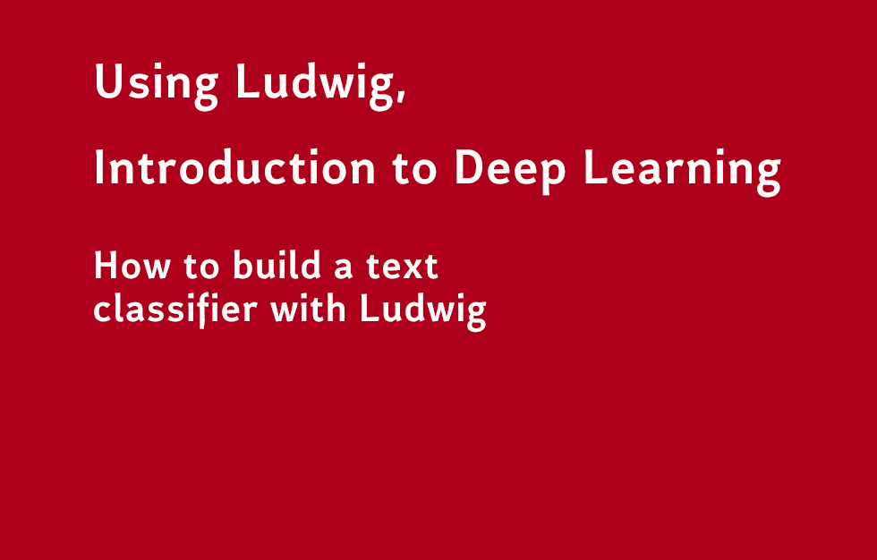
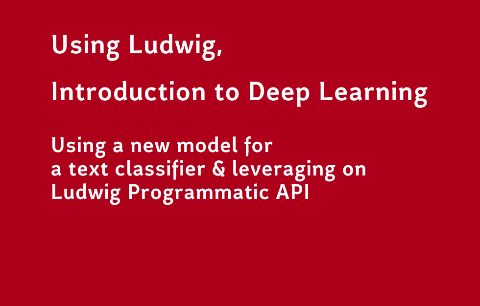

# using_ludwig_discovering_ia

## QUICK DEFINITION LUDWIG

- **Deep Learning experimentation toolbox based on TensorFlow**
- **No coding required**

## PLAY WITH LUDWIG

**Some good ressources**

- official website examples: 
    - [https://ludwig-ai.github.io/ludwig-docs/examples/](https://ludwig-ai.github.io/ludwig-docs/examples/)


- colab about Sentiment Analysis with Ludwig: 
    - [https://colab.research.google.com/drive/1J-WmhxCdwvlRDJyvcYd1TDsXhqGOMCRa?usp=sharing](https://colab.research.google.com/drive/1J-WmhxCdwvlRDJyvcYd1TDsXhqGOMCRa?usp=sharing)


- Piero Molino - presentation of ludwig: 
    - [https://w4nderlu.st/media/pages/projects/ludwig/2515616521-1603992934/ludwig_presentation.pdf](
https://w4nderlu.st/media/pages/projects/ludwig/2515616521-1603992934/ludwig_presentation.pdf)


- code and csv:
    - [https://github.com/srbh24/NLP/](https://github.com/srbh24/NLP/)
    - [https://github.com/TannerGilbert/Tutorials](https://github.com/TannerGilbert/Tutorials)
    - [https://www.kaggle.com/c/titanic/data](https://www.kaggle.com/c/titanic/data)
    - [https://github.com/topics/ludwig](https://github.com/topics/ludwig)

## INSTALL LUDWIG

- Ludwig requires you to use Python 3.6+. If you don't have Python 3 installed, install it by running:

```bash
sudo apt install python3  # on ubuntu
brew install python3      # on mac
```

- You may want to use a virtual environment to maintain an isolated Python environment.
```bash
virtualenv -p python3 venv
```

- In order to install Ludwig just run:
```bash
pip install ludwig
```

- Check LUDWIG Installation
```bash
ludwig -h
```

## QUICK EXPLANATATIONS

#### EPOCH, BATCHES... etc

- Deep learning often deals with copious amounts of data. 

- This data is broken down into smaller chunks (called batches) and fed to the neural networks one-by-one. 

- One epoch is when the entire dataset is passed forward and backward through the neural network once. 

- In order to generalize the model, there is more than one epoch in the majority of the deep learning models.

- The more the number of epochs, the more the parameters are adjusted thus resulting in a better performing model. However, too many epochs might lead to overfitting. If a model is overfitted, it does well in the train data and performs poorly on the test data.

- Iteration is the number of batches needed to complete one epoch.

> Suppose we have a dataset of 42,000 training examples and we divide it into batches of 600. To complete 1 epoch, it would have taken 70 (42,000 divided by 600) iterations.


#### REQUIREMENTS FOR LUDWIG, BATCHES

- You do not need to code to test training models. What is required by Ludwig is input and output? As an input, you need to have dataset in a .csv format plus a declarative model definition in .yaml format.


#### AFTER A TRAINING IN THE MAIN FOLDER
- Running Ludwig will create 2 files in the main folder: 
    - the file with .meta.json's extension will contain the mapping 
    - the file with .hdf5's extension will contain the data


#### AFTER A TRAINING IN THE RESULTS FOLDER
- In `/results/experiment_run/description.json`: Like it is indicated by the name, you have all the meta information about the command so the file description.json  that contains all the information on how the command was run, what was the input feature and the output feature ....

- In `/results/experiment_run/training_statistics.json`: the file contains basic stats on what is accuracy, loss... etc. of your model

- If you want to use model for a prediction, you just have to point to the model directory e.g `/results/experiment_run_3/model`


#### EXTRAS STUFF
- You can also visualize to compare models among them with the `visualize` command.

- There is also a Programmatic API that can be used directly in python script like any python library. Check [https://ludwig-ai.github.io/ludwig-docs/api/LudwigModel/](https://ludwig-ai.github.io/ludwig-docs/api/LudwigModel/)


## VIDEOS


[How to build a text classifier with Ludwig](https://www.youtube.com/watch?v=Iixub4_aiLM)
[](https://www.youtube.com/watch?v=Iixub4_aiLM)


[Using a new model for a text classifier & leveraging on Ludwig Programmatic API](https://www.youtube.com/watch?v=Iixub4_aiLM)
[](https://www.youtube.com/watch?v=Iixub4_aiLM)


[Predicting a passenger's surviving probability to the Titanic disaster with Ludwig](https://www.youtube.com/watch?v=Iixub4_aiLM)
[](https://www.youtube.com/watch?v=Iixub4_aiLM)


## EXAMPLES

**005_ludwig_example**
``` bash
.
├── 005_ludwig_example # example_1 
│   ├── imdb_model_definition_1.yaml # first data model
│   ├── imdb_model_definition_2.yaml # second data model
│   ├── imdb_model_definition_3.yaml # third data model
│   ├── predict_example_1_imbdb.csv # predict sample data
│   ├── predict_example_2_imbdb.csv # predict sample data
│   ├── predict.sh # shell script to launch training
│   ├── python_ludwig_api_1.py # using the Programmatic API
│   ├── README.md
│   ├── train.sh # shell script to launch train
│   ├── train_example_imbdb.csv # train sample data
│   └── visualize.sh # shell script to launch visualize


```

**006_ludwig_example**
``` bash
.
├── 006_ludwig_example # example_2 
│   ├── gender_submission.csv # one of the csv
│   ├── model_definition.yaml # data model
│   ├── python_ludwig_titanic_1.ipynb # the jupyter notebook
│   ├── python_ludwig_titanic_1.py # the python script
│   ├── README.md
│   ├── test_1.csv # first csv for predict
│   ├── test_2.csv # secodn csv for predict
│   └── train.csv # thes training csv


```