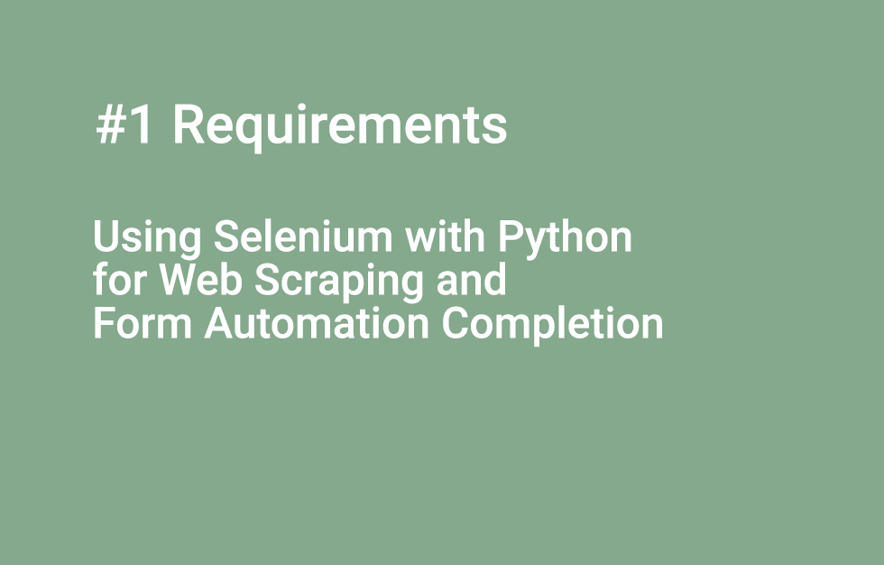
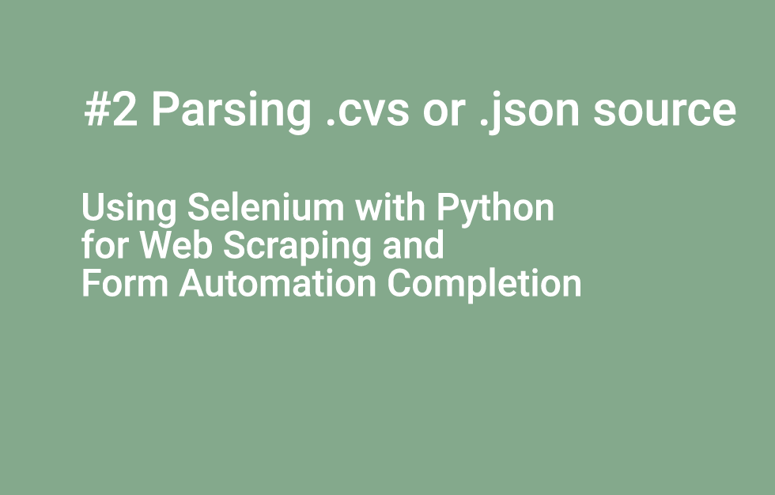
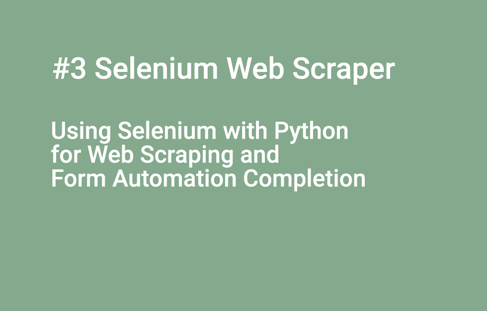

# using_selenium_web_scraping_automation

The code for the post "Using Selenium with Python for Web Scraping and Form Automation Completion" released on [http://flaven.fr/](http://flaven.fr/)


**Using Selenium with Python for Web Scraping and Form Automation Completion [https://flaven.fr/2022/08/using-selenium-with-python-for-web-scraping-and-form-automation-completion/](https://flaven.fr/2022/08/using-selenium-with-python-for-web-scraping-and-form-automation-completion/)**

And to see some extra notes on PopcornFlow and on The Law of Two Feet, check out `take_aways_popcornflow_two_feet_law.md`

## VIDEOS

[#1 Requirements Using Selenium with Python for Web Scraping and Form Automation Completion](https://www.youtube.com/watch?v=gobL6g0kVBs)
[](https://www.youtube.com/watch?v=gobL6g0kVBs)

<!-- #1 Requirements Using Selenium with Python for Web Scraping and Form Automation Completion
https://youtu.be/gobL6g0kVBs
001_using_selenium_web_scraping_automation_requirements.png -->


[#2 Parsing .cvs or .json source Using Selenium with Python for Web Scraping and Form Automation Completion](https://www.youtube.com/watch?v=DLgm-s2v-U4)
[](https://www.youtube.com/watch?v=DLgm-s2v-U4)

<!-- #2 Parsing .cvs or .json source Using Selenium with Python for Web Scraping and Form Automation Completion
https://youtu.be/DLgm-s2v-U4
002_using_selenium_web_scraping_automation_parsing_csv_json_python.png -->


[#3 Create a Selenium WebScraper Using Selenium with Python for Web Scraping and Form Automation Completion](https://www.youtube.com/watch?v=w-hK_7t_biQ)
[](https://www.youtube.com/watch?v=w-hK_7t_biQ)


<!-- #3 Create a Selenium WebScraper Using Selenium with Python for Web Scraping and Form Automation Completion
https://youtu.be/w-hK_7t_biQ
003_using_selenium_web_scraping_automation_stackabuse_scraper_selenium_web_scraping.png
 -->


## REQUIREMENTS
If you want to be in the same development environment, you can follow the step 1 and step 2 below.

### 1. Install XAMPP to have a local WP Frontend and Backend
You need to have a local WP installed and declare in your hosts file the domain e.g https://cypress.mydomain.priv/wordpress/ that leads to WP.

- Download XAMPP [https://www.apachefriends.org/download.html](https://www.apachefriends.org/download.html)
- Download WordPress [https://wordpress.org/download/](https://wordpress.org/download/)

```bash
# edit your hosts on a mac
sudo -s
vi /etc/hosts


# type I for insert

# cut and paste the domain cypress.mydomain.priv
127.0.0.1 cypress.mydomain.priv

# save ctrl+C then :wq
# you are good

# quit the root session
exit

# just ping in the console, to ensure that it is OK
ping localhost
ping 127.0.0.1
ping cypress.mydomain.priv

```


### 2. Install the Python environment with anaconda

You can install ANACONDA to handle different python development environments. It is free for download [https://www.anaconda.com/](https://www.anaconda.com/)

```bash
[env]
# Conda Environment
conda create --name web_scraping_selenium python=3.9.7
conda info --envs
source activate web_scraping_selenium
conda deactivate
# if needed to remove
conda env remove -n [NAME_OF_THE_CONDA_ENVIRONMENT]

# to export requirements
pip freeze > web_scraping_selenium.txt


# to install
pip install -r web_scraping_selenium.txt


# update conda
conda update -n base -c defaults conda


```

### 3. Install Python packages (Selenium, Pandas... etc)
You can find the Python requirements at the root of this directory but you can also install individually the Python packages in a new anaconda environment.


```python
# install pandas
pip install pandas


# BeautifulSoup
pip install bs4

# other module
pip install requests
pip install selenium
pip install datetime

# more for selenimum

# download selenimum
curl https://files.pythonhosted.org/packages/ed/9c/9030520bf6ff0b4c98988448a93c04fcbd5b13cd9520074d8ed53569ccfe/selenium-3.141.0.tar.gz > selenium.tar.gz

# unpack selenimum
tar -xzvf selenium.tar.gz

# install selenimum
cd selenium-3.141.0
python setup.py install


brew --cask install chromedriver
```

### Project's Tree Directory

*The output for command `tree -L 2`*

```bash
.
├── README.md
├── parsing_csv_json_python
│   ├── 001_web_creating_post_selenium_wp.py
│   ├── 002_web_creating_post_selenium_wp.py
│   ├── 003_web_creating_post_json_selenium_wp.py
│   ├── 004_web_creating_post_csv_selenium_wp.py
│   ├── README.md
│   ├── datasets
│   ├── read_csv_pandas_python_csv_001.py
│   ├── read_csv_pandas_python_csv_002.py
│   ├── read_json_python_001.py
│   ├── read_json_python_002.py
│   ├── read_json_python_003.py
│   ├── read_json_python_004.py
│   ├── read_json_python_005.py
│   └── read_posts_json_python_001.py
├── selenium_web_scraping
│   ├── 001_web_scraping_selenium_supernyv.py
│   ├── 001a_web_scraping_selenium_supernyv.py
│   ├── 002_web_scraping_selenium.py
│   ├── 003_web_scraping_selenium.py
│   ├── 010_web_scraping_selenium.py
│   ├── 011_web_scraping_selenium.py
│   ├── 013_web_scraping_selenium.py
│   ├── 013_web_scraping_selenium_test_pwd.txt
│   ├── 014_web_scraping_selenium_wp.py
│   ├── 015_web_scraping_selenium_wp.py
│   ├── 016_web_scraping_selenium_wp.py
│   ├── 017_web_scraping_selenium_wp.py
│   ├── README.md
│   ├── main_nav_labels_files
│   └── screenshots
├── stackabuse_scraper
│   ├── README.md
│   ├── stackabuse_doc.html
│   ├── stackabuse_scraper_001.py
│   ├── stackabuse_scraper_002.py
│   ├── stackabuse_scraper_003.py
│   ├── stackabuse_scraper_004.py
│   ├── stackabuse_scraper_website_001.py
│   └── stackabuse_scraper_website_002.py
├── take_aways_popcornflow_two_feet_law.md
└── web_scraping_selenium.txt
```


### Git commands memo

```bash
# GIT 2022

# hint: go to the directory
cd /Users/brunoflaven/Documents/03_git/BlogArticlesExamples


# hint: know your branch
git branch

# hint: check for status
git status

# hint: for any change just type this command
git add .

# hint: add a commit with a message
git commit -am "add repo"
git commit -am "update files"

# hint: push to Github if your branch on Github is master
git push origin master


# connect or reconnect
# https://docs.github.com/en/authentication/keeping-your-account-and-data-secure/creating-a-personal-access-token
Username: your_username
Password: your_token


# launch sh
sh automate_commit.sh

```
